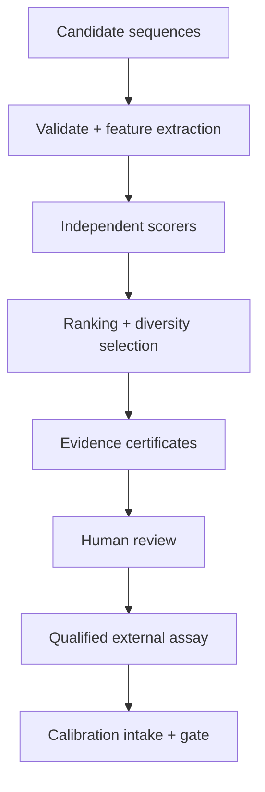
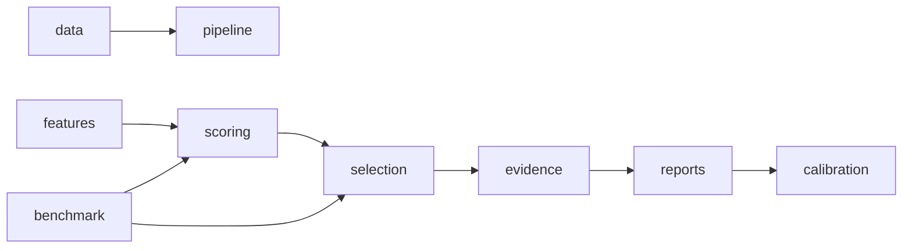
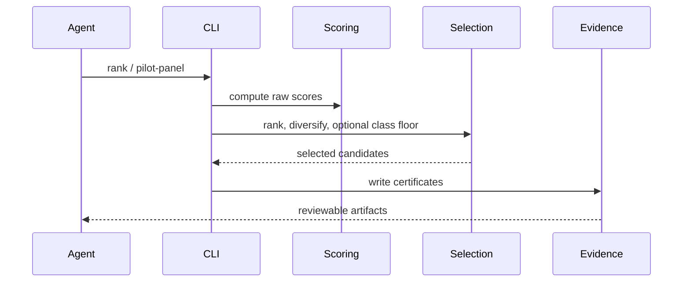

# OpenAMP Foundry Agent Skill

## Overview

Start from `docs/README.md`, then use the relevant domain hub. For scientific
work, read the current truth source `docs/evidence/METRICS_CURRENT.md`, then
`docs/research/ROADMAP.md`, then `AGENTS.md`. Treat computational scores as triage only.
Do not describe candidates as active, safe, therapeutic, or validated without
qualified lab evidence.

## Key Components

- `src/openamp_foundry/pipeline.py`: rank candidates and emit evidence.
- `src/openamp_foundry/scoring/`: activity, safety, hemolysis, novelty,
  synthesis, expert, and rich selectivity scorers.
- `src/openamp_foundry/selection/`: ensemble/expert ranking, diversity, pilot
  panel selection, and structural-class floors.
- `src/openamp_foundry/benchmark/` plus `scripts/benchmarks/`: benchmark
  honesty checks and regression entrypoints.
- `src/openamp_foundry/calibration/`: lab-result intake, gate, and proposal-only
  recalibration.

## Diagrams

### Flowchart

### Component Diagram

### Sequence Diagram

## Start Here

1. Read `AGENTS.md`, `CLAUDE.md`, `MISSION.md`, and `docs/evidence/METRICS_CURRENT.md`.
2. Treat `docs/evidence/METRICS_CURRENT.md` plus `outputs/metrics_snapshot.json` as the
   current benchmark truth when docs disagree.
3. For the required disconfirming pass, use
   `docs/evidence/DISCONFIRMING_TEST_RECORD_GUIDE.md` when recording a challenge.
4. Preserve the safety boundary: dry-lab scoring and evidence only. No wet-lab
   protocols, pathogen enablement, toxicity-maximizing objectives, or biological
   proof claims.

## High-Leverage Benchmark Checks

- `make bench-500`: broad AMP-vs-decoy discrimination.

## Disconfirming-evidence gate

Phase AC records are two-layered: `disconfirming_test_record.py` stores one
attempt to break a claim, while `phase_ac_disconfirming_gate.py` aggregates
those records. A refuted record requires an explicit claim downgrade and an
inconclusive record requires investigation. An empty aggregate is
`not_established`, not a pass. Run
`openamp-foundry phase-ac-disconfirming-gate-check --entry-json ...` or
`make phase-ac-disconfirming-gate-check` to exercise the aggregate workflow;
the command exits nonzero until the aggregate is verified. Neither artifact is
biological validation.

The Phase AA reproducibility gate is also available as a normal review-loop
command: `openamp-foundry phase-aa-reproducibility-gate-check --entry-json ...`
or `make phase-aa-reproducibility-gate-check`. It returns success only when
RMC, DCR, CFP, and SBW artifact IDs are all present. This is a structural
provenance check, not proof that the underlying run is scientifically correct
or biologically valid.

External-result intake is also fail-closed at the review boundary. Use the
structured loader/report fields `invalid_lab_result_files` and
`input_validation_status` to preserve schema-invalid returns; the
`calibration-intake` command exits nonzero and the recalibration gate refuses
to proceed while any invalid file is excluded. Missing or non-directory result
paths return an input error before a report is written. An existing empty
directory is the only valid zero-result state. Duplicate result IDs and
duplicate panel candidate IDs are also preserved as `input_integrity_issues` and
block clean intake. These controls catch incomplete or ambiguous input, not
assay-quality or biological-validity problems. Control-failed assay observations
remain visible for audit but are excluded from per-assay actual predicates,
cohort metrics, and interpretable per-candidate outcome flags. Raw outcome fields
and failed-result IDs remain available for audit; failed controls still block
recalibration.

- `make bench-easy-baseline`: trivial length/charge baselines.
- `make bench-charge-matched`: adversarial check that removes charge-density
  separation before comparing ensemble vs charge alone.
- `make bench-per-family`: structural-class blind spots.
- `make bench-selectivity`: hemolytic-vs-selective AMP ranking.
- `make metrics-snapshot`: regenerate the machine-readable source of truth.

## Current v0.5.38 Note

The charge-matched decoy benchmark is an honesty check, not a win claim. Correct
pH-7.4 charge-density matching remains imperfect with the current decoy pool
(`mean_abs_charge_density_delta=0.1296`), and charge density still beats the
ensemble (`0.8166` vs `0.7792`). Treat raw AMP-vs-decoy AUROC as charge-inflated
until a better charge-balanced negative set exists.
