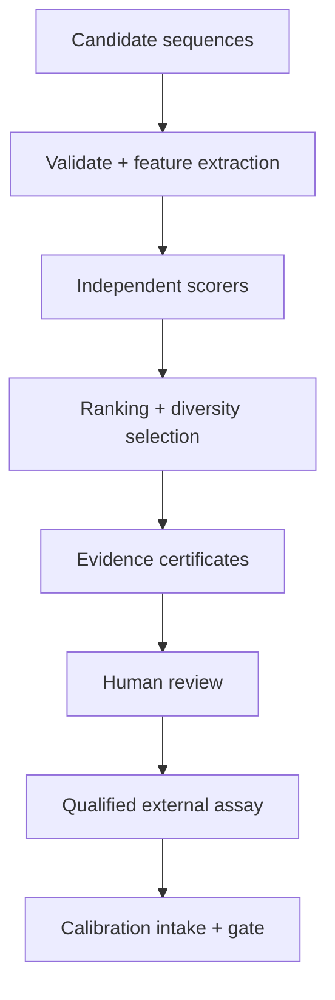
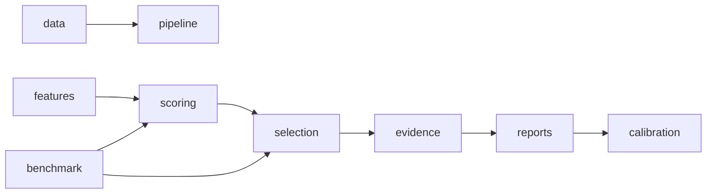
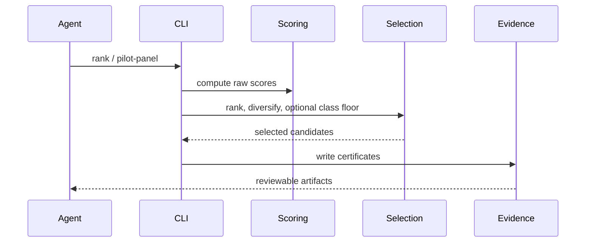

# OpenAMP Foundry Agent Skill

## Overview

Start from `docs/README.md`, then use the relevant domain hub. For scientific
work, read the current truth source `docs/METRICS_CURRENT.md`, then
`docs/ROADMAP.md`, then `AGENTS.md`. Treat computational scores as triage only.
Do not describe candidates as active, safe, therapeutic, or validated without
qualified lab evidence.

## Key Components

- `src/openamp_foundry/pipeline.py`: rank candidates and emit evidence.
- `src/openamp_foundry/scoring/`: activity, safety, hemolysis, novelty,
  synthesis, expert, and rich selectivity scorers.
- `src/openamp_foundry/selection/`: ensemble/expert ranking, diversity, pilot
  panel selection, and structural-class floors.
- `src/openamp_foundry/benchmark/` plus `scripts/benchmark_*.py`: benchmark
  honesty checks.
- `src/openamp_foundry/calibration/`: lab-result intake, gate, and proposal-only
  recalibration.

## Diagrams

### Flowchart

### Component Diagram

### Sequence Diagram

## Start Here

1. Read `AGENTS.md`, `CLAUDE.md`, `MISSION.md`, and `docs/METRICS_CURRENT.md`.
2. Treat `docs/METRICS_CURRENT.md` plus `outputs/metrics_snapshot.json` as the
   current benchmark truth when docs disagree.
3. Preserve the safety boundary: dry-lab scoring and evidence only. No wet-lab
   protocols, pathogen enablement, toxicity-maximizing objectives, or biological
   proof claims.

## High-Leverage Benchmark Checks

- `make bench-500`: broad AMP-vs-decoy discrimination.
- `make bench-easy-baseline`: trivial length/charge baselines.
- `make bench-charge-matched`: adversarial check that removes charge-density
  separation before comparing ensemble vs charge alone.
- `make bench-per-family`: structural-class blind spots.
- `make bench-selectivity`: hemolytic-vs-selective AMP ranking.
- `make metrics-snapshot`: regenerate the machine-readable source of truth.

## Current v0.5.38 Note

The charge-matched decoy benchmark is an honesty check, not a win claim. Correct
pH-7.4 charge-density matching remains imperfect with the current decoy pool
(`mean_abs_charge_density_delta=0.1296`), and charge density still beats the
ensemble (`0.8166` vs `0.7792`). Treat raw AMP-vs-decoy AUROC as charge-inflated
until a better charge-balanced negative set exists.
