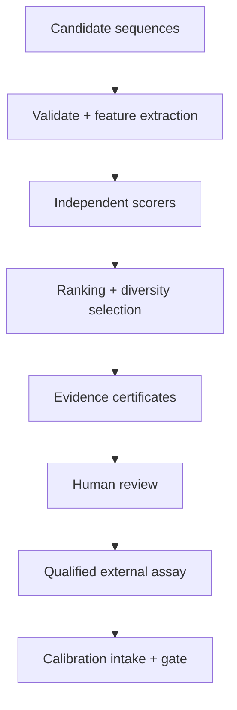
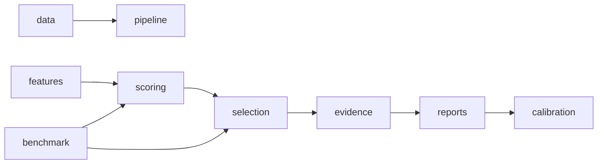
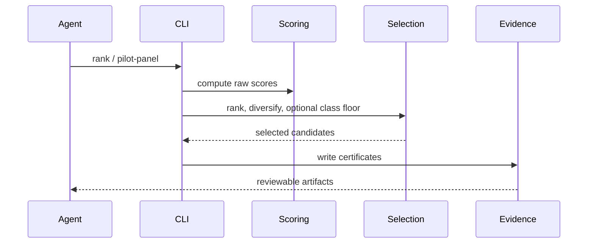

# OpenAMP Foundry Agent Skill

## Overview

Start from the current truth source: `docs/METRICS_CURRENT.md`, then
`docs/ROADMAP.md`, then `AGENTS.md`. Treat computational scores as triage only.
Do not describe candidates as active, safe, therapeutic, or validated without
qualified lab evidence.

## Key Components

- `src/openamp_foundry/pipeline.py`: rank candidates and emit evidence.
- `src/openamp_foundry/scoring/`: activity, safety, hemolysis, novelty,
  synthesis, expert, and rich selectivity scorers.
- `src/openamp_foundry/selection/`: ensemble/expert ranking, diversity, pilot
  panel selection, and structural-class floors.
- `src/openamp_foundry/benchmark/` plus `scripts/benchmark_*.py`: benchmark
  honesty checks.
- `src/openamp_foundry/calibration/`: lab-result intake, gate, and proposal-only
  recalibration.

## Diagrams

### Flowchart

### Component Diagram

### Sequence Diagram

