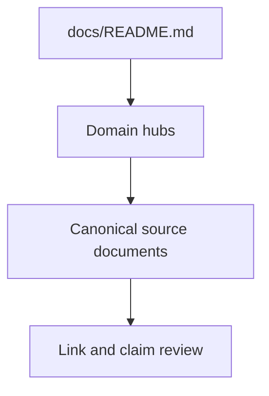
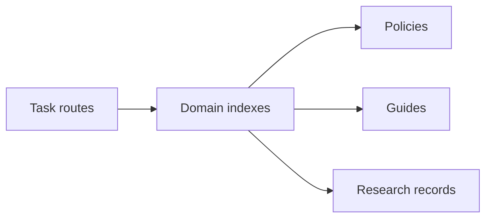
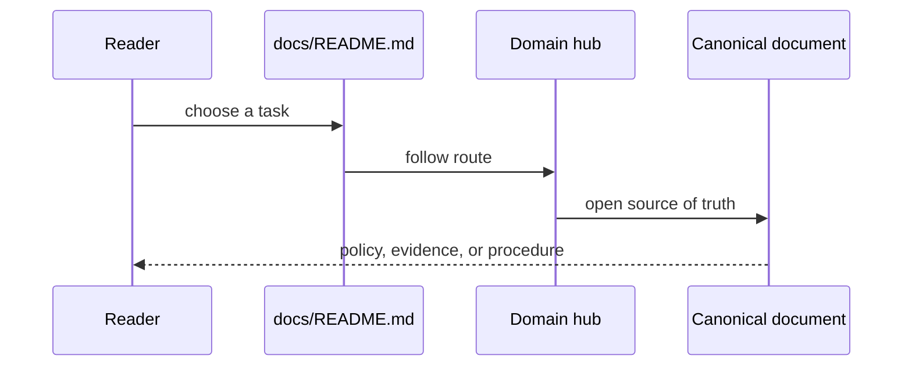

# Documentation

## Overview

`docs/README.md` is the navigation front door. Domain `README.md` files are
curated routes. `PROJECT_INDEX.md` is the exhaustive catalog. Canonical
documents remain at stable paths to preserve public links.

## Key Components

- `README.md`: role and task routing.
- `trust/`, `evidence/`, `engineering/`: domain navigation.
- `getting-started/`, `operations/`, `review/`: contributor workflows.
- `research/`: current strategy separated from historical records.
- `PROJECT_INDEX.md`: complete inventory.
- Current status pages should expose executable review gates and their expected
  fail-closed behavior, not imply that a gate is biological validation.
- The current status route includes the Phase Z ZAG- per-family accountability
  workflow; its presence check must remain distinct from benchmark superiority.

## Diagrams

### Flowchart

### Component Diagram

### Sequence Diagram

## Maintenance Rules

1. Add a document to exactly one primary domain hub.
2. Cross-link it elsewhere only when a real workflow requires it.
3. Never let a historical record override current metrics or policy.
4. Update `PROJECT_INDEX.md` for important new documents.
5. Run the documentation link check before completion.
