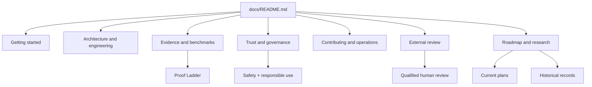

# OpenAMP Documentation

This is the documentation front door. Start with a route, not the file list.

> **Evidence boundary:** OpenAMP outputs are computational evidence and review
> aids. They are not biological proof, clinical advice, or laboratory
> instructions.

## Choose your route

| I need to… | Start here |
|---|---|
| Install and run OpenAMP | [Getting started](getting-started/README.md) |
| Understand the system | [Architecture and engineering](engineering/README.md) |
| Evaluate evidence or claims | [Evidence and benchmarks](evidence/README.md) |
| Review safety or release posture | [Trust and governance](trust/README.md) |
| Contribute as a human or agent | [Contributing and operations](operations/README.md) |
| Prepare qualified external review | [External review](review/README.md) |
| Understand plans and prior investigations | [Roadmap and research](research/README.md) |

## Three documents that prevent most mistakes

1. [Trust Center](trust/TRUST_CENTER.md) defines the safety, evidence, and release
   architecture.
2. [Proof Ladder](evidence/PROOF_LADDER.md) limits claims to their evidence level.
3. [Current Metrics](evidence/METRICS_CURRENT.md) records current measured performance
   and known weaknesses.

## Documentation map

## Source-of-truth rules

- Safety: [`../SAFETY.md`](../SAFETY.md) and
  [`../RESPONSIBLE_USE.md`](../RESPONSIBLE_USE.md).
- Claims: [`evidence/PROOF_LADDER.md`](evidence/PROOF_LADDER.md) and
  [`evidence/CLAIM_REVIEW_CHECKLIST.md`](evidence/CLAIM_REVIEW_CHECKLIST.md).
- Metrics: [`evidence/METRICS_CURRENT.md`](evidence/METRICS_CURRENT.md).
- Current work: [`research/ROADMAP.md`](research/ROADMAP.md) and
  [`research/NEXT_100_PR_MAP.md`](research/NEXT_100_PR_MAP.md).
- Full document catalog: [`PROJECT_INDEX.md`](PROJECT_INDEX.md).

Documents describing a wave, audit, recommendation, or dated plan are records
of work under stated assumptions. They do not override current policy, metrics,
or release status.
