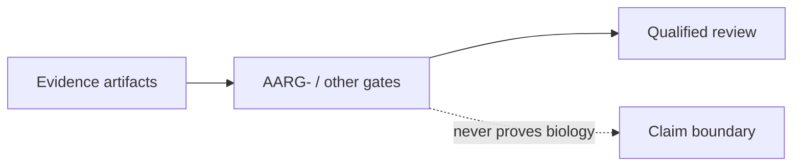

# Evidence Documentation

## Overview

Evidence docs define what artifacts can support and where claims must stop.
Gate workflows are structural review controls, never biological proof.

## Key Components

- `METRICS_CURRENT.md`: current measured evidence and limitations.
- `PROOF_LADDER.md`: maximum claim strength by evidence level.
- AARG-: checks presence of reproducibility artifacts before certification.

## Diagrams (Mermaid)

