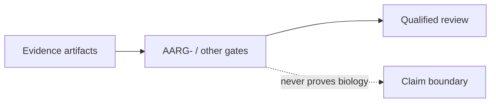

# Evidence Documentation

## Overview

Evidence docs define what artifacts can support and where claims must stop.
Gate workflows are structural review controls, never biological proof.

## Key Components

- `METRICS_CURRENT.md`: current measured evidence and limitations.
- `PROOF_LADDER.md`: maximum claim strength by evidence level.
- AARG-: checks presence of reproducibility artifacts before certification.
- ZAG-: checks presence of per-family benchmark and adapter-accountability
  artifacts before that review surface is treated as complete.
- Lab-result intake blockers are evidence-completeness signals, not assay
  validation; invalid files must remain visible in reports and gates.
- Control-failed assay observations remain visible for audit but are excluded
  from per-assay calibration predicates, cohort metrics, and interpretable
  candidate outcome flags and usable batch-level qualitative counts; raw fields
  and raw summary counts remain available for audit and they cannot support
  recalibration.
- The Phase R SRG- workflow exposes scientific-review readiness through the CLI
  and Make surface; conditional, incomplete, safety-blocked, or malformed
  records must fail closed.

## Diagrams (Mermaid)

