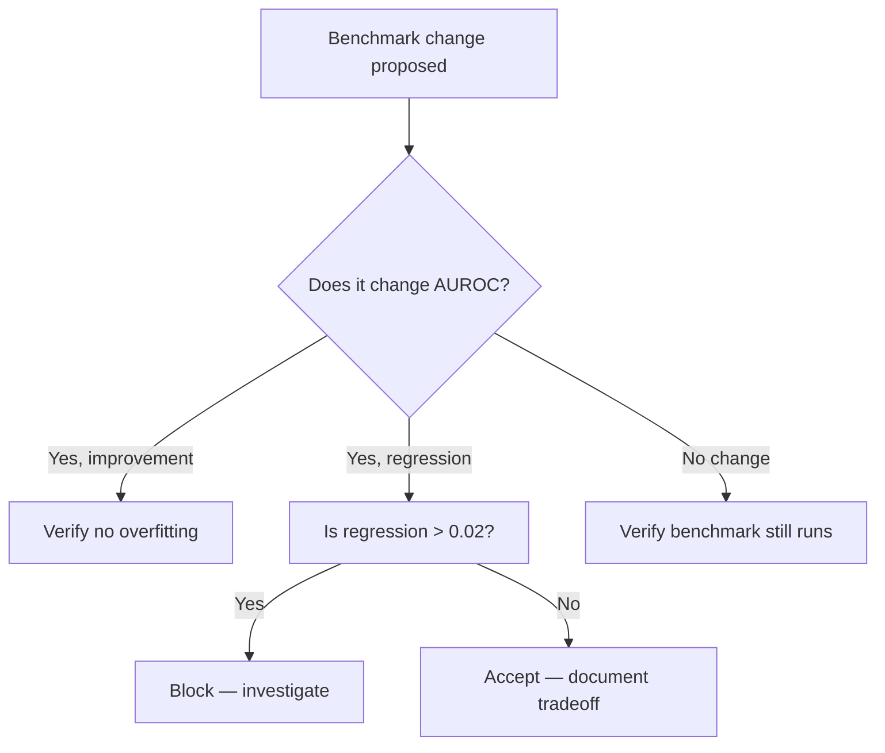

# Decision Tree: Benchmark Change Review

```mermaid
flowchart TD
  A[Benchmark change proposed] --> B{Does it change AUROC?}
  B -->|Yes, improvement| C[Verify no overfitting]
  B -->|Yes, regression| D[Is regression > 0.02?]
  D -->|Yes| E[Block — investigate]
  D -->|No| F[Accept — document tradeoff]
  B -->|No change| G[Verify benchmark still runs]
```
