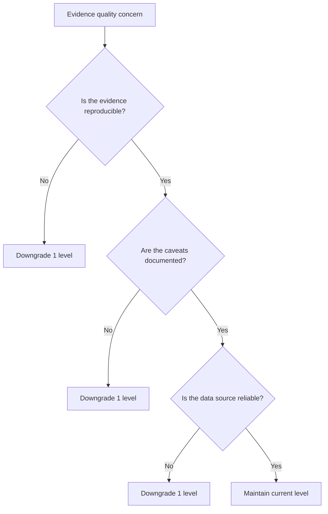

# Decision Tree: Evidence Downgrade

```mermaid
flowchart TD
  A[Evidence quality concern] --> B{Is the evidence reproducible?}
  B -->|No| C[Downgrade 1 level]
  B -->|Yes| D{Are the caveats documented?}
  D -->|No| E[Downgrade 1 level]
  D -->|Yes| F{Is the data source reliable?}
  F -->|No| G[Downgrade 1 level]
  F -->|Yes| H[Maintain current level]
```
