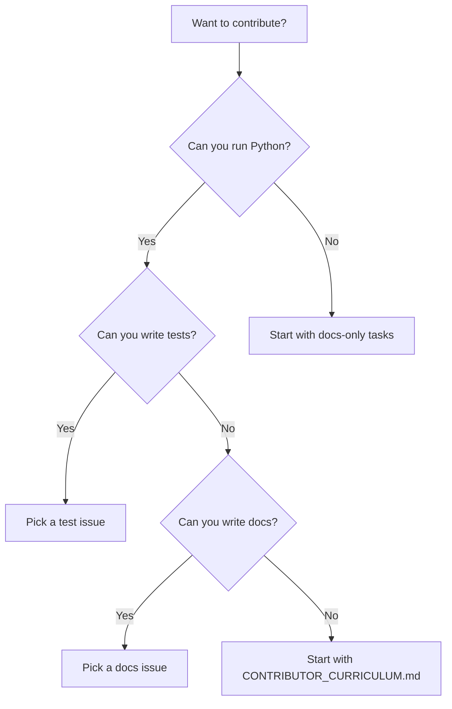

# Decision Tree: Choosing First Contribution

```mermaid
flowchart TD
  A[Want to contribute?] --> B{Can you run Python?}
  B -->|Yes| C{Can you write tests?}
  B -->|No| D[Start with docs-only tasks]
  C -->|Yes| E[Pick a test issue]
  C -->|No| F{Can you write docs?}
  F -->|Yes| G[Pick a docs issue]
  F -->|No| H[Start with CONTRIBUTOR_CURRICULUM.md]
```
