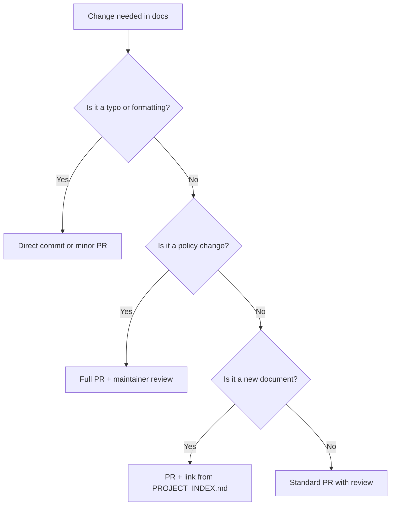

# Decision Tree: Opening a Documentation PR

```mermaid
flowchart TD
  A[Change needed in docs] --> B{Is it a typo or formatting?}
  B -->|Yes| C[Direct commit or minor PR]
  B -->|No| D{Is it a policy change?}
  D -->|Yes| E[Full PR + maintainer review]
  D -->|No| F{Is it a new document?}
  F -->|Yes| G[PR + link from PROJECT_INDEX.md]
  F -->|No| H[Standard PR with review]
```
