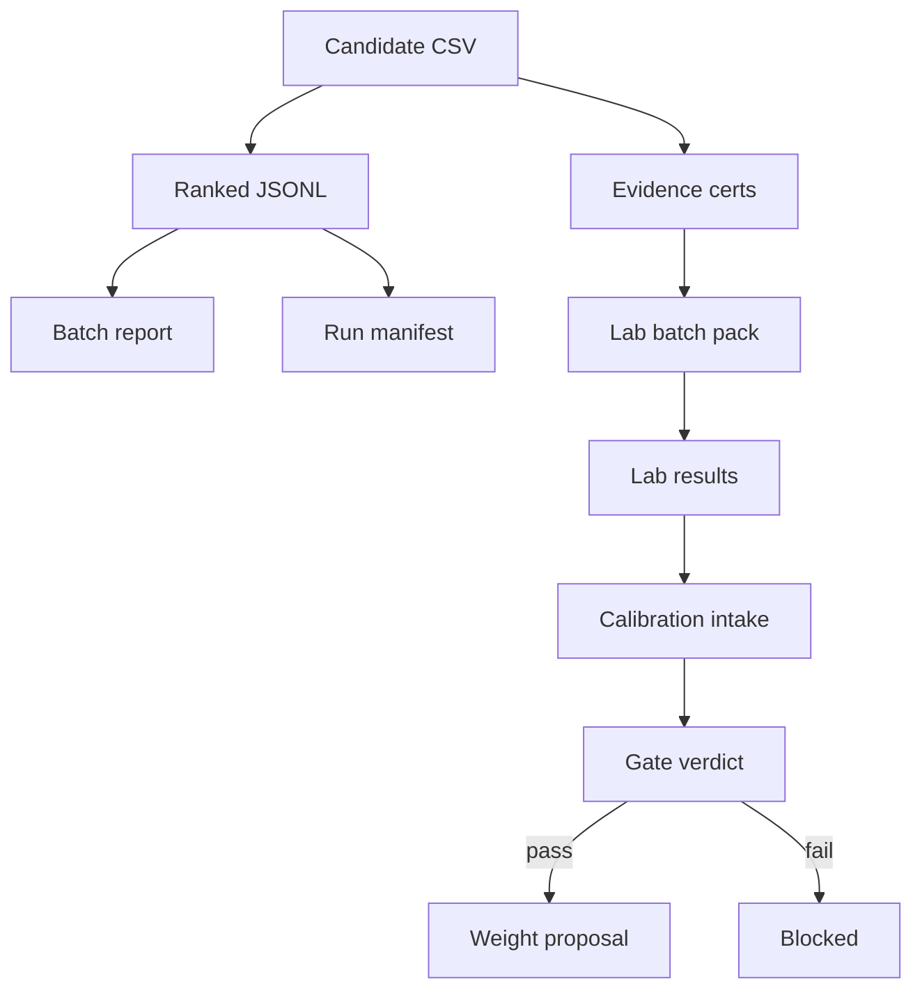

# Artifact Dependency Graph

Shows how artifacts depend on each other.

## Rules
- Artifacts higher in the graph are inputs.
- Arrows show the direction of data flow.
- Dotted lines indicate optional dependencies.
- The graph should be updated when new artifact types are added.
