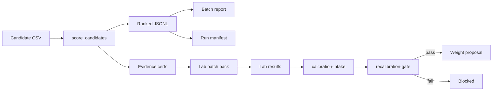

# End-to-End Artifact Flow Diagram

```mermaid
flowchart LR
  A[Candidate CSV] --> B[score_candidates]
  B --> C[Ranked JSONL]
  B --> D[Evidence certs]
  C --> E[Batch report]
  C --> F[Run manifest]
  D --> G[Lab batch pack]
  G --> H[Lab results]
  H --> I[calibration-intake]
  I --> J[recalibration-gate]
  J -->|pass| K[Weight proposal]
  J -->|fail| L[Blocked]
```

This diagram shows the flow from candidate input through scoring, reporting,
lab partnership, and calibration.
