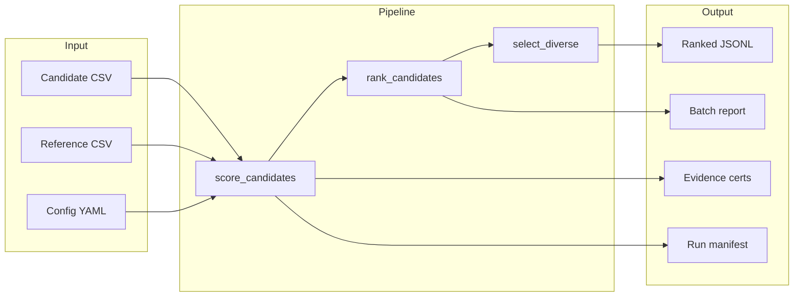

# Data Flow and Data Boundary Map

## Data Boundaries
- **Input boundary**: Candidate CSV, reference CSV, config YAML
- **Pipeline boundary**: `score_candidates` → `rank_candidates` → `select_diverse`
- **Output boundary**: JSONL, evidence certs, manifest, report
- **External boundary**: Lab results (returned by partners)
