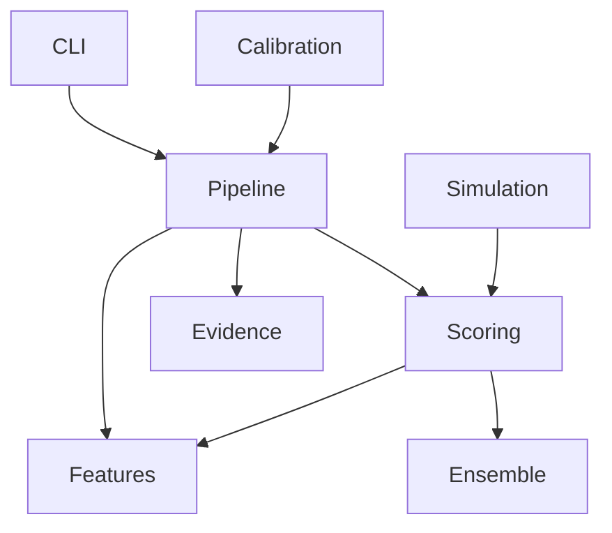

# Dependency Graph Explanation

How pipeline components depend on each other.

## Description
- **CLI** depends on **Pipeline** (calls `run_ranking_pipeline`)
- **Pipeline** depends on **Features** (feature extraction), **Scoring** (individual scorers), and **Evidence** (certificate generation)
- **Scoring** depends on **Features** (physicochemical features) and **Ensemble** (weighted combination)
- **Simulation** feeds into **Scoring** (via `--simulation-mode info`)
- **Calibration** feeds back into **Pipeline** (weight updates after human review)
