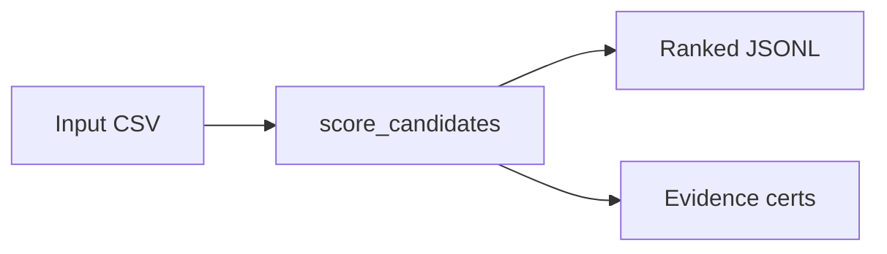

# Artifact Lineage Markdown Renderer

How artifact lineage is documented in markdown.

## Format
```markdown
## Artifact Lineage


```

## Rules
- Lineage diagrams should use Mermaid flowchart format.
- Show inputs → process → outputs.
- Label each node with the artifact name and format.
- Keep lineage diagrams focused on one artifact type at a time.
- Include the lineage in the artifact's documentation.
