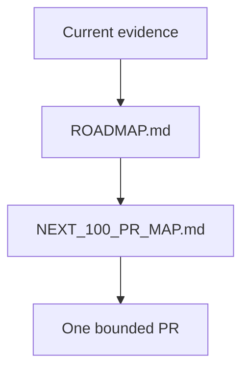

# Research Roadmap

## Overview

Current roadmap docs distinguish shipped infrastructure from future scientific
work and preserve the external-truth bottleneck.

## Key Components

- `ROADMAP.md`: current milestone authority.
- `NEXT_100_PR_MAP.md`: bounded, reviewable work items.
- `50_LOOP_PLAN.md`: historical execution record only.
- The current external-truth bottleneck includes fail-closed result-input
  completeness before any recalibration decision and explicit separation of
  raw versus control-passing candidate outcomes.

## Diagrams (Mermaid)

