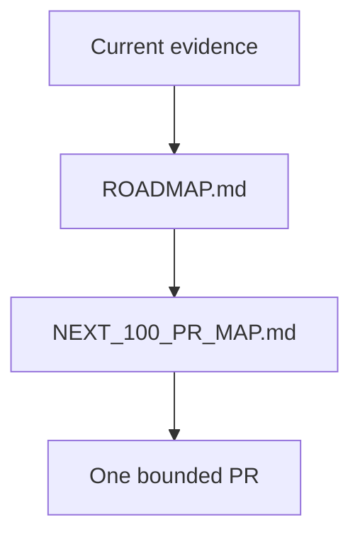

# Research Roadmap

## Overview

Current roadmap docs distinguish shipped infrastructure from future scientific
work and preserve the external-truth bottleneck.

## Key Components

- `ROADMAP.md`: current milestone authority.
- `NEXT_100_PR_MAP.md`: bounded, reviewable work items.
- `50_LOOP_PLAN.md`: historical execution record only.
- The current external-truth bottleneck includes fail-closed result-input
  completeness before any recalibration decision and explicit separation of
  raw versus control-passing candidate and batch outcomes. Orphan result
  candidates that are absent from the submitted panel are also retained and
  block clean intake. Opted-in panels also verify the frozen `panel_id` across
  matched results; mismatches and partial coverage block clean intake.
- The next executable review boundary is the Phase R SRG- workflow. Its default
  example is intentionally blocked because qualified wet-lab evidence is not
  present; do not treat the gate as validation.

## Diagrams (Mermaid)

