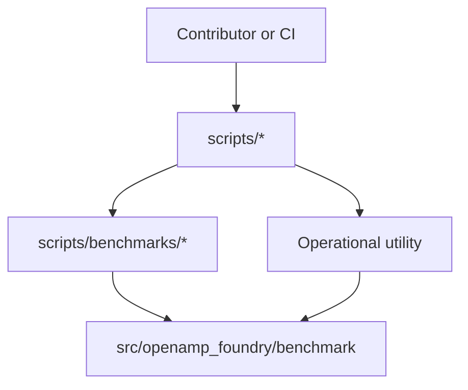
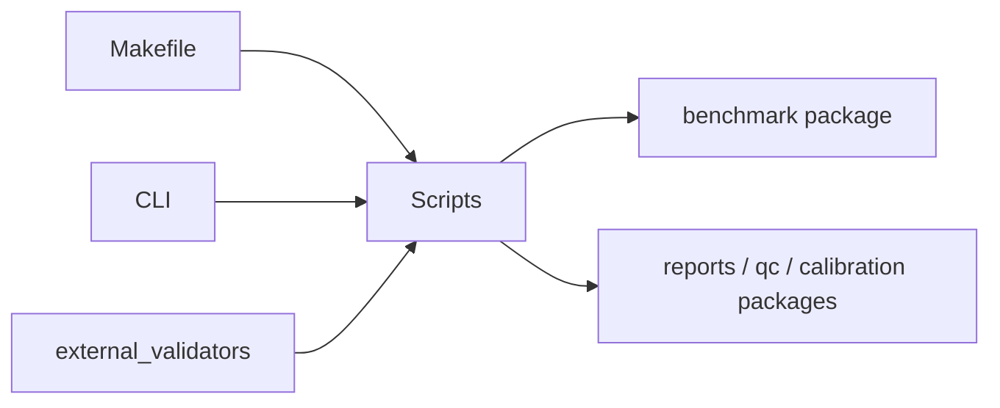
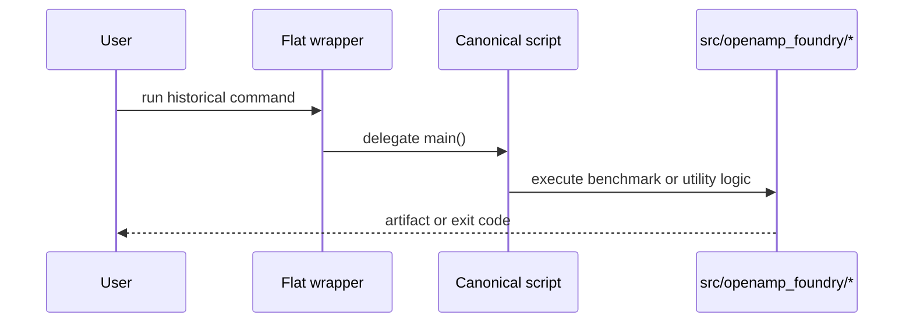

# Scripts

## Overview

`scripts/` contains human-invoked repository utilities. Canonical benchmark
entrypoints live in `scripts/benchmarks/`. Flat files at `scripts/*.py` may
exist as compatibility shims when historical docs or old commands still point
there.

## Key Components

- `benchmarks/`: benchmark and baseline entrypoints.
- `calibration/`: policy bump and synthetic calibration-loop entrypoints.
- `external/`: predictor submission, normalization, consensus, and sponsor handoff.
- `lab/`: lab handoff, validation, and pass/fail entrypoints.
- `novelty/`: novelty DB refresh, audit, and patent-risk entrypoints.
- `release/`: demo, evidence, validation, regeneration, and reproducibility entrypoints.
- `research/`: exploratory generation, screening, restoration, and dataset-expansion scripts.
- `waves/`: wave-program generation, novelty audit, and panel-selection entrypoints.
- `external_validators/`: browser and Node-driven external validation helpers.
- top-level `*.py`: transitional wrappers or non-benchmark operational scripts.

## Diagrams (Mermaid)

- Flowchart

- Component Diagram

- Sequence Diagram

