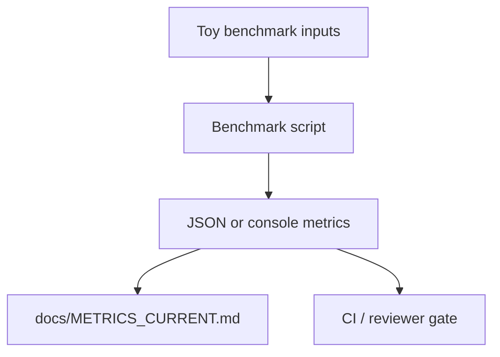
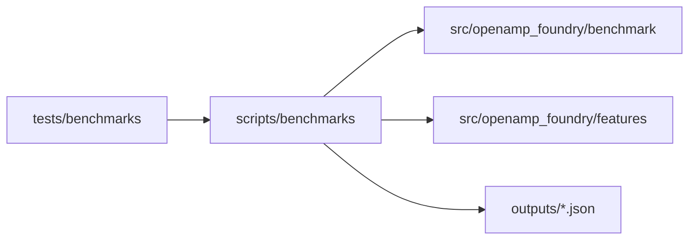
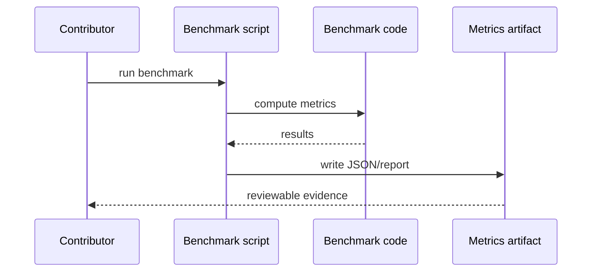

# Benchmark Scripts

## Overview

This folder is the canonical home for benchmark, baseline, and benchmark-data
curation entrypoints. If a benchmark path in docs or CI disagrees with this
folder, this folder wins and compatibility wrappers should be updated.

## Key Components

- `benchmark_*.py`: benchmark runners and regression gates.
- `baseline_trivial.py`: cheapest-enemy benchmark.
- `curate_500_amp_benchmark.py`: benchmark dataset curation.
- `expand_benchmark.py`: benchmark expansion utility.

## Diagrams (Mermaid)

- Flowchart

- Component Diagram

- Sequence Diagram

