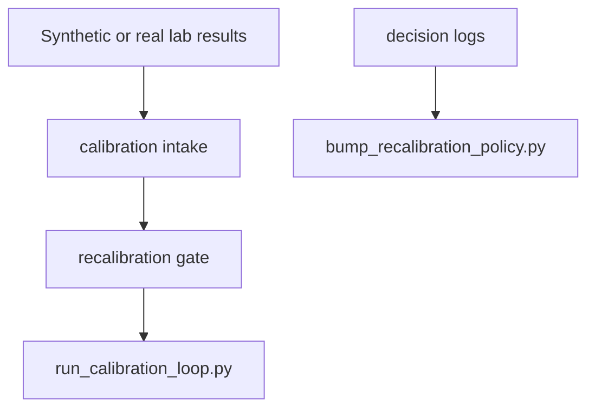
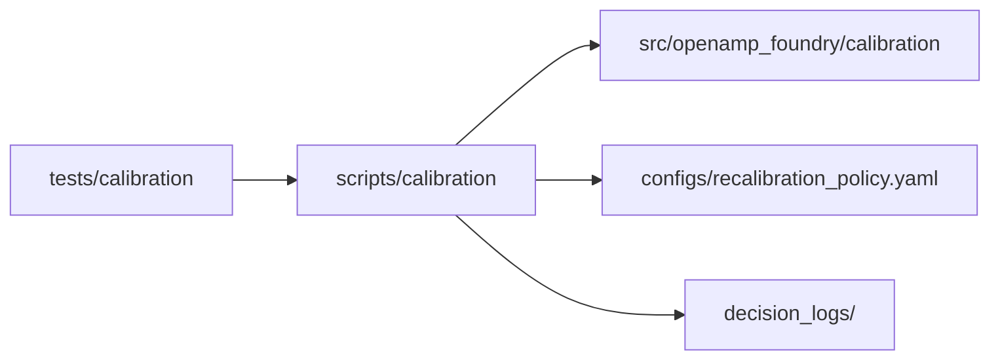

# Calibration Scripts

## Overview

This folder is the canonical home for calibration workflow entrypoints:
policy-version management and full synthetic calibration-loop execution.

## Key Components

- `bump_recalibration_policy.py`: guarded policy-version bump workflow.
- `run_calibration_loop.py`: synthetic end-to-end calibration loop.

## Diagrams (Mermaid)

- Flowchart



- Component Diagram



- Sequence Diagram

```mermaid
sequenceDiagram
  participant Maintainer
  participant Bump as bump_recalibration_policy
  participant Loop as run_calibration_loop
  participant CalPkg as calibration package
  Maintainer->>Bump: approve version bump
  Bump->>CalPkg: validate and increment policy
  Maintainer->>Loop: run synthetic calibration loop
  Loop->>CalPkg: intake -> gate -> engine -> batch selection
```
