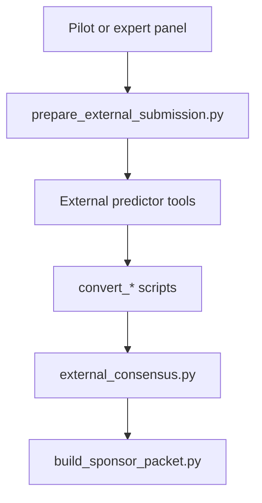
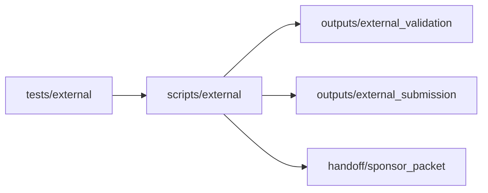
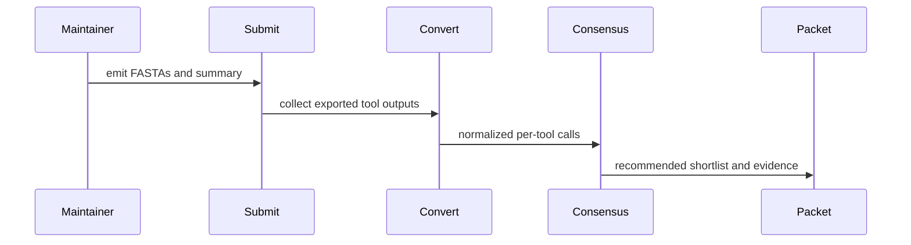

# External Scripts

## Overview

This folder is the canonical home for external predictor submission, result
normalization, cross-tool consensus, and sponsor-facing handoff assembly.

## Key Components

- `create_predictor_results.py`
- `prepare_external_submission.py`
- `convert_ampactipred.py`
- `convert_macrel_web.py`
- `external_consensus.py`
- `build_sponsor_packet.py`

## Diagrams (Mermaid)

- Flowchart

- Component Diagram

- Sequence Diagram

