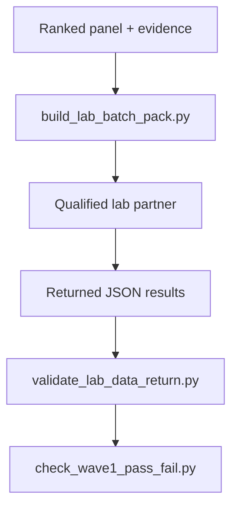
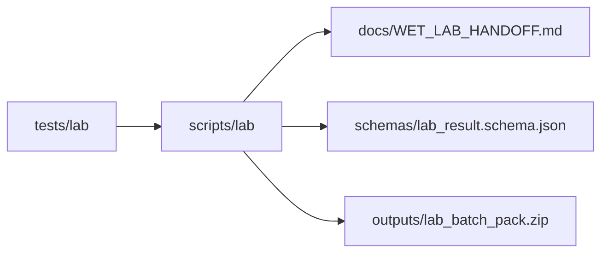
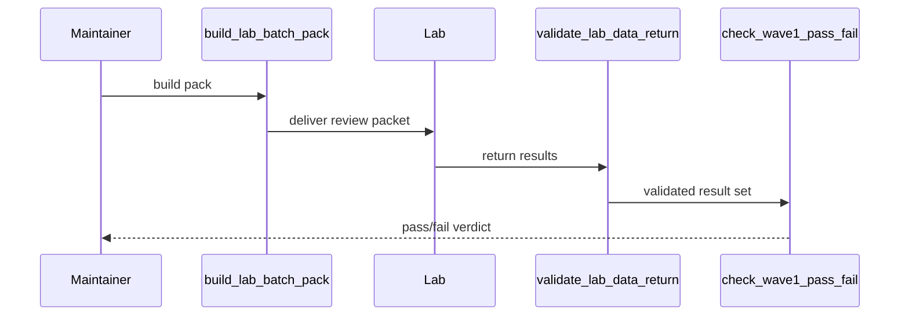

# Lab Scripts

## Overview

This folder is the canonical home for lab handoff utilities: building partner
packs, validating returned data, and checking pre-registered batch criteria.

## Key Components

- `build_lab_batch_pack.py`: package candidate artifacts for qualified labs.
- `validate_lab_data_return.py`: validate returned JSON results.
- `check_wave1_pass_fail.py`: evaluate batch results against frozen criteria.

## Diagrams (Mermaid)

- Flowchart

- Component Diagram

- Sequence Diagram

