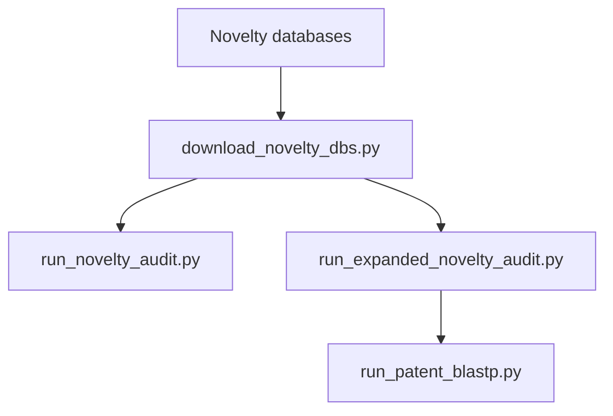
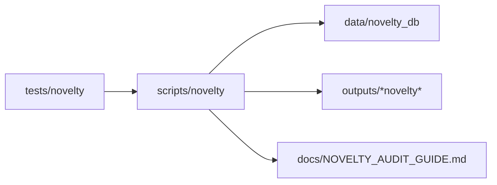
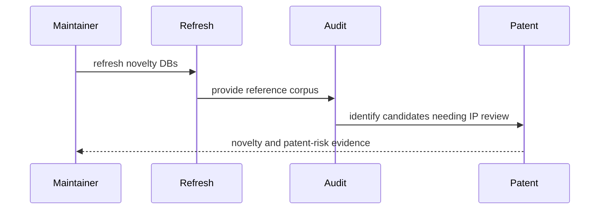

# Novelty Scripts

## Overview

This folder is the canonical home for novelty-database refresh, novelty audit,
and patent-risk search entrypoints.

## Key Components

- `download_novelty_dbs.py`
- `run_novelty_audit.py`
- `run_expanded_novelty_audit.py`
- `run_patent_blastp.py`

## Diagrams (Mermaid)

- Flowchart

- Component Diagram

- Sequence Diagram

