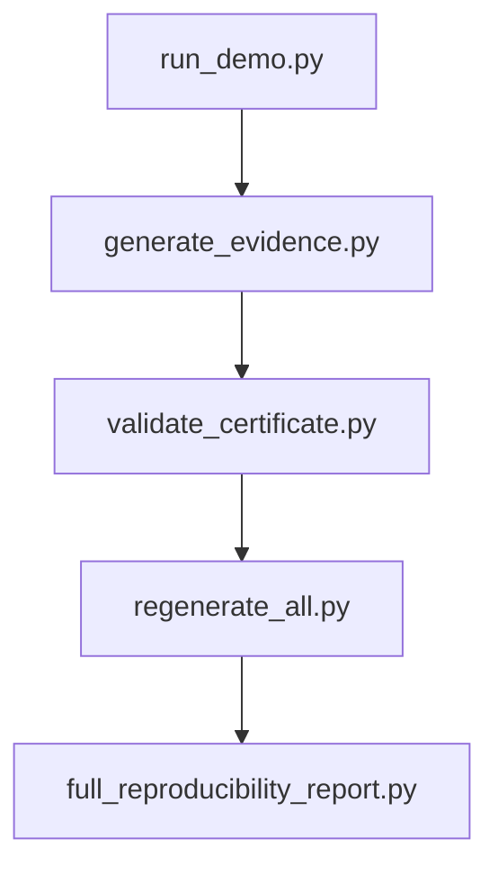
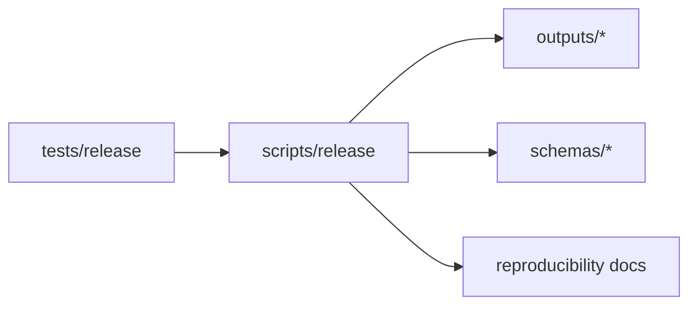
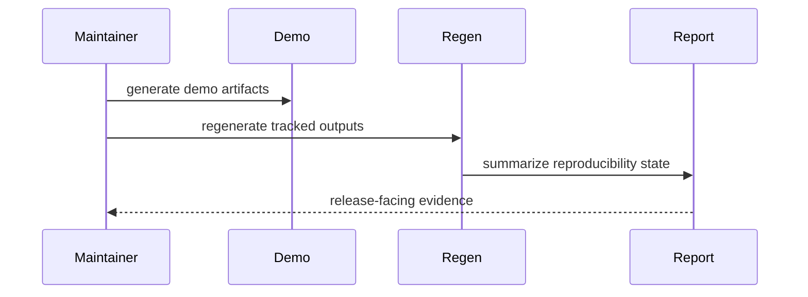

# Release Scripts

## Overview

This folder is the canonical home for release-facing artifact operations:
demo generation, certificate validation, output regeneration, and full
reproducibility reporting.

## Key Components

- `run_demo.py`
- `generate_evidence.py`
- `validate_certificate.py`
- `regenerate_all.py`
- `full_reproducibility_report.py`

## Diagrams (Mermaid)

- Flowchart

- Component Diagram

- Sequence Diagram

