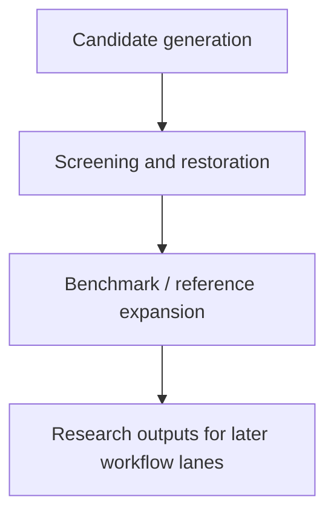
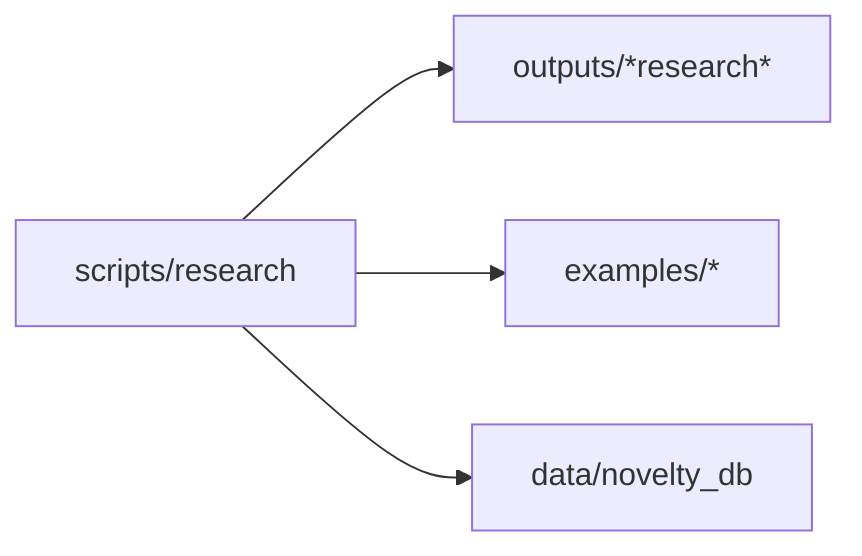
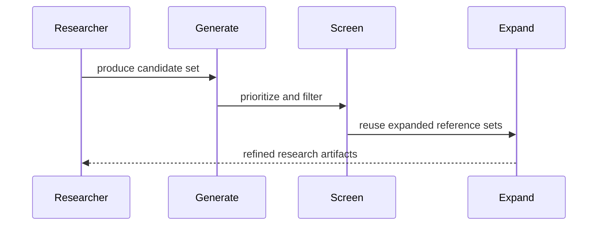

# Research Scripts

## Overview

This folder is the canonical home for exploratory generation, large-batch
screening, dataset expansion, and restoration scripts that support research
campaigns rather than stable operator workflows.

## Key Components

- `generate_expert_1000.py`
- `generate_denovo_novel_amps.py`
- `generate_100_novel_amps.py`
- `generate_1000_novel_amps.py`
- `screen_1000_candidates.py`
- `restore_master_csv.py`
- `build_amp_library.py`
- `expand_hemolysis_benchmark.py`
- `expand_scrambled_decoys.py`
- `generate_phase3_batch.py`

## Diagrams (Mermaid)

- Flowchart

- Component Diagram

- Sequence Diagram

