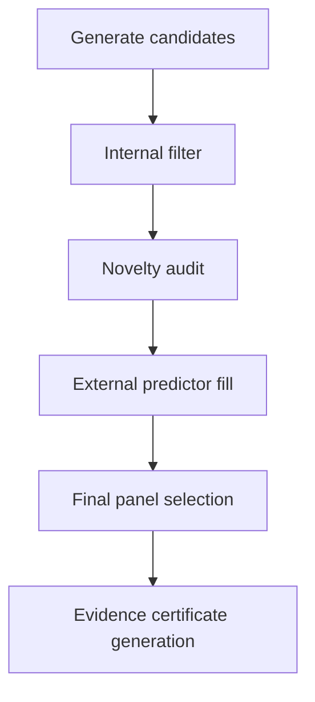
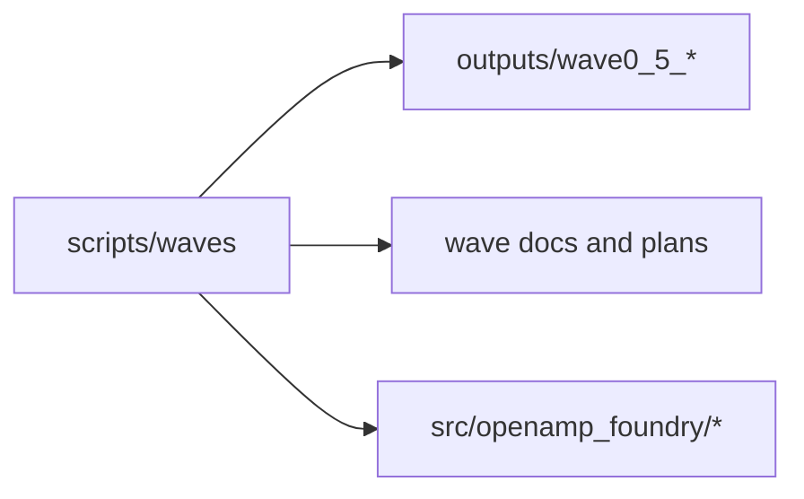
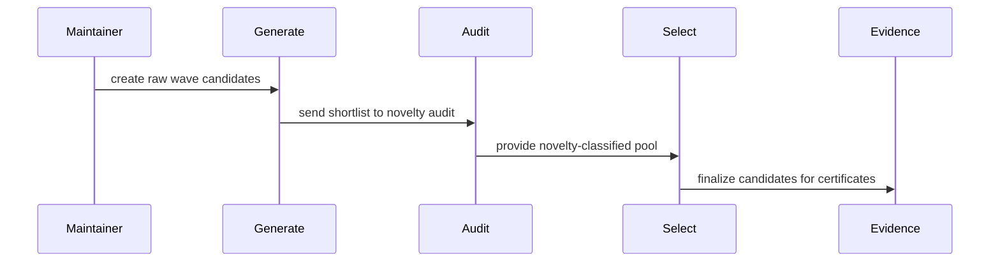

# Wave Scripts

## Overview

This folder is the canonical home for wave-program execution scripts:
Wave 0.5/0.5b generation, filtering, novelty audit, external fill, evidence
packaging, and final panel selection.

## Key Components

- `generate_wave0_5_candidates.py`
- `filter_wave0_5_candidates.py`
- `run_wave0_5_novelty_audit*.py`
- `fill_wave0_5_external_results.py`
- `select_wave1_panel.py`
- `generate_wave0_5_evidence_certs.py`
- `generate_wave0_5b_candidates.py`
- `filter_wave0_5b_candidates.py`

## Diagrams (Mermaid)

- Flowchart

- Component Diagram

- Sequence Diagram

