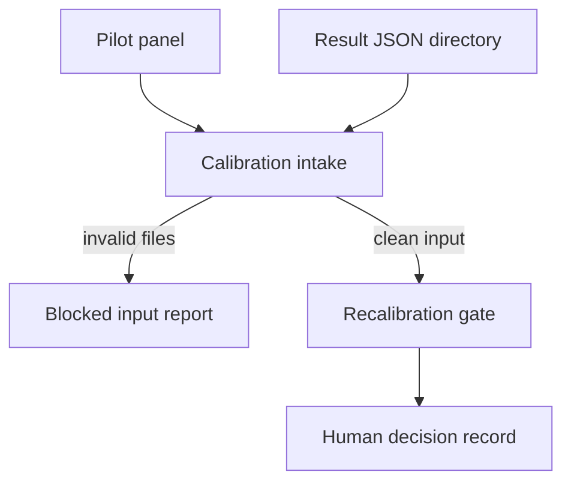
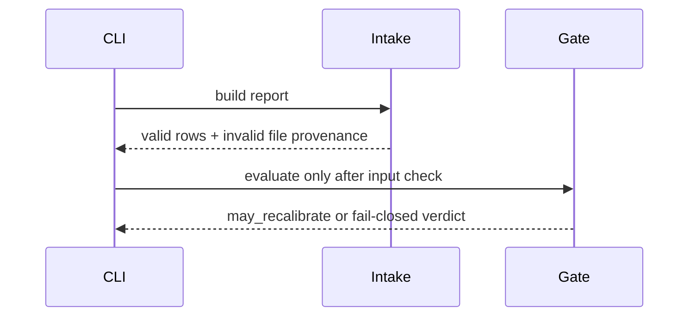

# Calibration

## Overview

This package joins computational panel predictions to validated result
records, reports descriptive cohort metrics, and evaluates a human-gated
recalibration policy.

## Key Components

- `intake.py`: result join and input-validation status.
- `recalibration_gate.py`: fail-closed policy verdict; never applies weights.

## Diagrams (Mermaid)

Invalid result files are excluded from metrics but remain in the report and
force the recalibration verdict to false. No result is treated as biological
proof.
