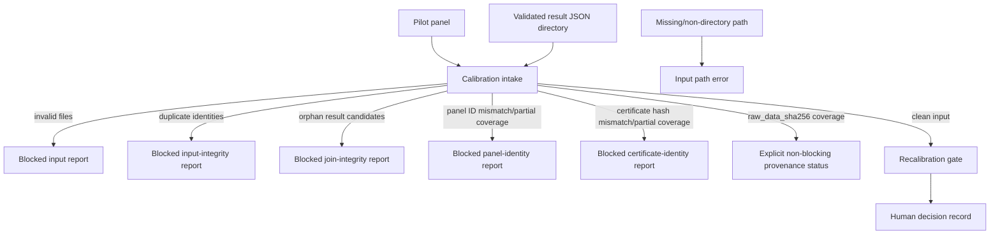
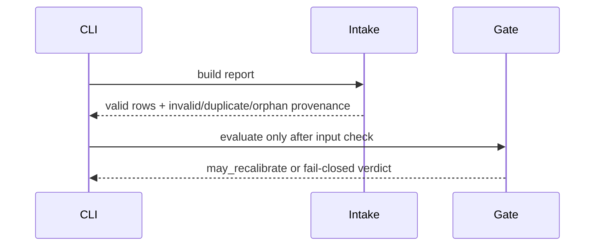

# Calibration

## Overview

This package joins computational panel predictions to validated result
records, reports descriptive cohort metrics, and evaluates a human-gated
recalibration policy.

## Key Components

- `intake.py`: result join and input-validation status.
- `recalibration_gate.py`: fail-closed policy verdict; never applies weights.
- Optional `computational_candidate_certificate_hash` values in the panel are
  checked against each result's required certificate hash. Mismatches and
  incomplete opted-in coverage block clean intake; legacy panels report the
  identity check as unavailable.
- Optional `panel_id` values in the panel are checked against each matched
  result to prevent cross-panel joins. Mismatches, multiple submitted panel
  IDs, and incomplete opted-in coverage block clean intake; legacy panels
  report panel identity as unavailable.
- Intake reports also expose raw assay-file hash coverage from the optional
  `raw_data_sha256` field. The statuses distinguish no results, unavailable
  declarations, partial declarations, and declarations for all loaded results;
  a declaration is not an independent hash verification and is non-blocking.

## Diagrams (Mermaid)

Invalid result files are excluded from metrics but remain in the report and
force the recalibration verdict to false. No result is treated as biological
proof. Missing or non-directory result paths fail before report generation;
only an existing empty directory represents a known no-results state. Duplicate
result IDs and duplicate panel candidate IDs likewise block clean intake because
they make the evidence identity ambiguous. Control-failed assay observations
remain in the audit report but are excluded from per-assay actual predicates and
cohort metrics, while still blocking recalibration.
Lab results whose candidate IDs are absent from the submitted panel are retained
as orphan provenance but block clean intake because they cannot be joined to a
prior prediction; they must not silently inflate the result directory's evidence.
