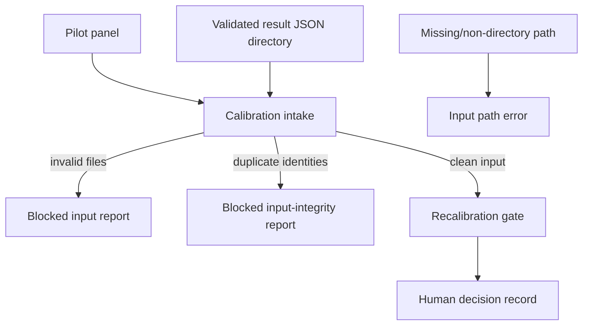
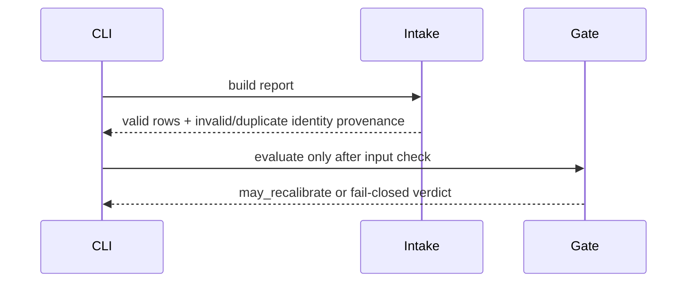

# Calibration

## Overview

This package joins computational panel predictions to validated result
records, reports descriptive cohort metrics, and evaluates a human-gated
recalibration policy.

## Key Components

- `intake.py`: result join and input-validation status.
- `recalibration_gate.py`: fail-closed policy verdict; never applies weights.

## Diagrams (Mermaid)

Invalid result files are excluded from metrics but remain in the report and
force the recalibration verdict to false. No result is treated as biological
proof. Missing or non-directory result paths fail before report generation;
only an existing empty directory represents a known no-results state. Duplicate
result IDs and duplicate panel candidate IDs likewise block clean intake because
they make the evidence identity ambiguous. Control-failed assay observations
remain in the audit report but are excluded from per-assay actual predicates and
cohort metrics, while still blocking recalibration.
