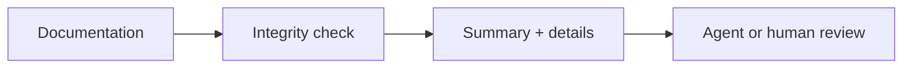
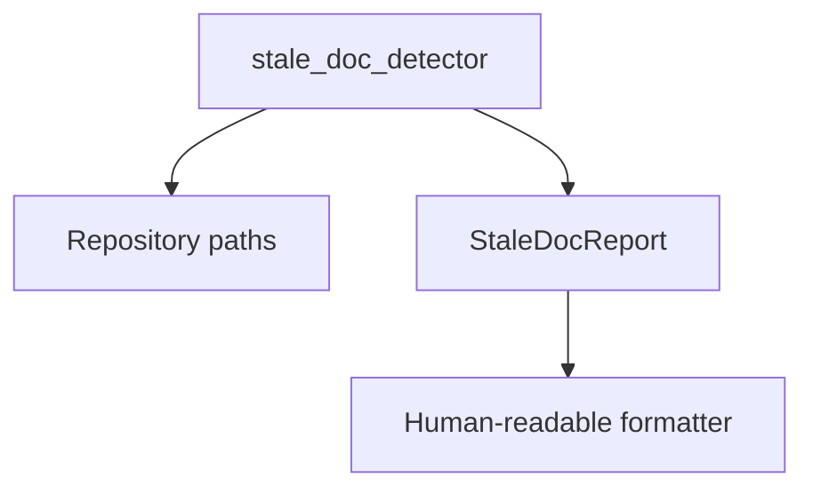
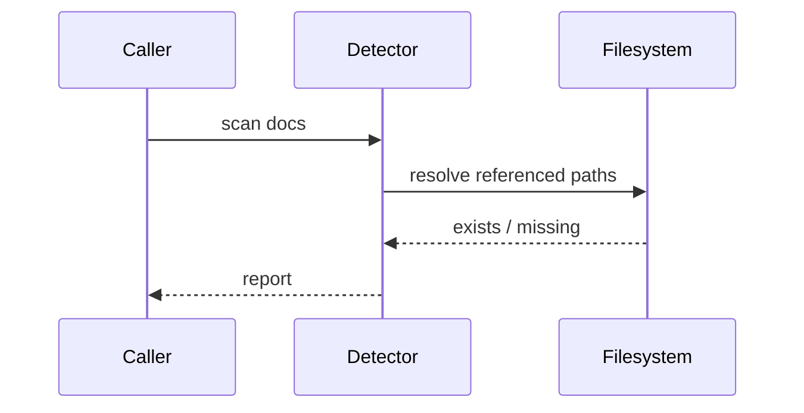

# Repository Checks

## Overview

This package contains deterministic repository-integrity checks. These checks
inspect source, documentation, and generated metadata; they do not validate
biological activity, safety, or release readiness.

## Key Components

- `stale_doc_detector.py` finds backtick-quoted, repo-relative file references
  in documentation and reports references whose targets no longer exist.
- Check formatters keep summary metrics distinct from detail-section headings
  so clean and failing output remain human- and machine-readable.

## Diagrams

### Flowchart

### Component Diagram

### Sequence Diagram

