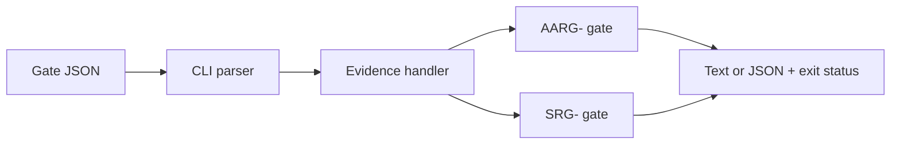
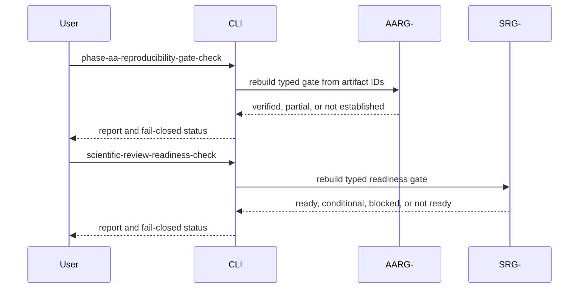

# CLI Commands

## Overview

The CLI exposes safe, deterministic review and evidence checks. Commands must
preserve dry-lab claim boundaries and fail closed when a gate is incomplete.

## Key Components

- `main.py`: parser and command dispatch.
- `commands/reports.py`: structured evidence and gate handlers.
- `phase-aa-reproducibility-gate-check`: runs the AARG- presence gate; only
  `reproducibility_verified` returns exit code 0.
- `scientific-review-readiness-check`: runs the SRG- readiness gate; only
  `ready_for_external_review` returns exit code 0. The checked-in Make example
  is intentionally blocked until qualified evidence exists.

## Diagrams (Mermaid)

