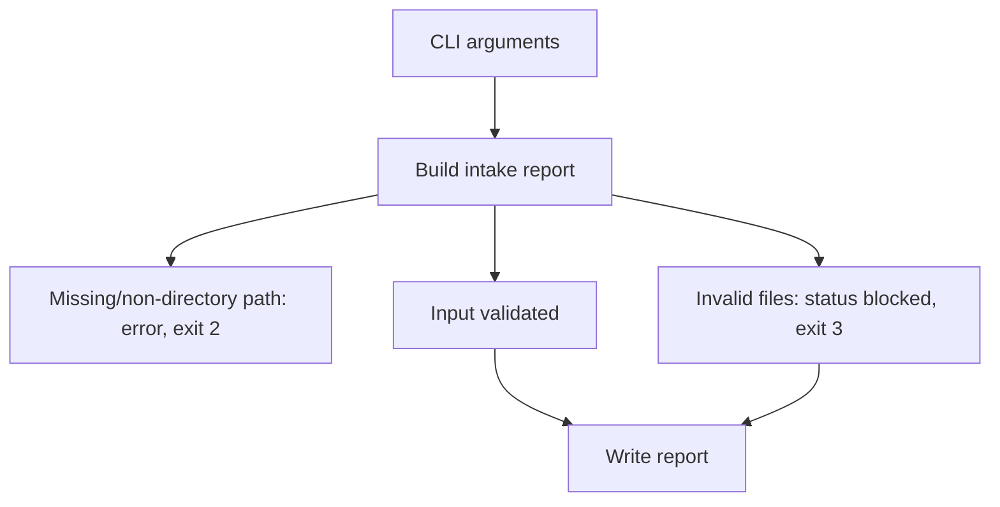
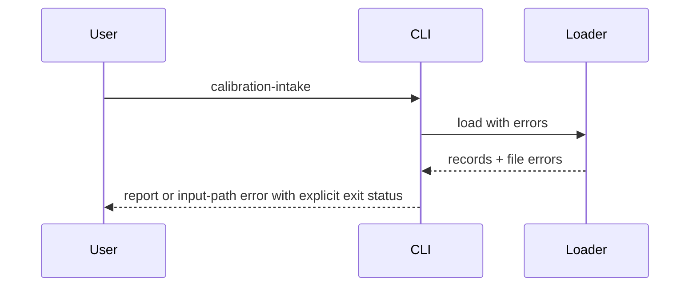

# CLI Commands

## Overview

Handlers expose deterministic report and gate workflows with explicit exit
codes. They do not authorize release or apply recalibration.

## Key Components

- `reports.py`: lab-result and calibration intake command handlers.
- `main.py`: parser and dispatch in the parent directory.

## Diagrams (Mermaid)

