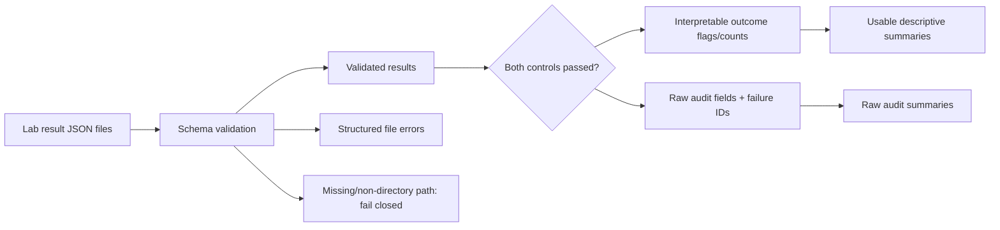
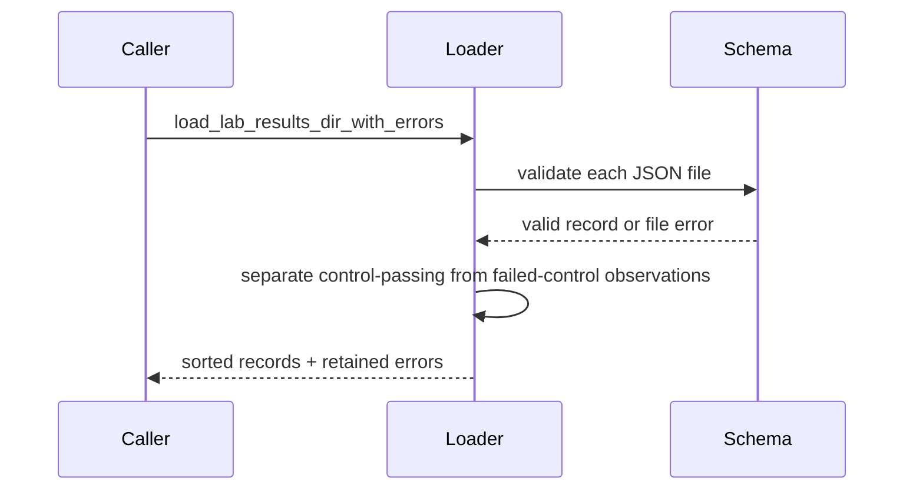

# Data Loading

## Overview

This package owns candidate and lab-result loading. Lab-result ingestion is
descriptive evidence plumbing, not biological validation.

## Key Components

- `lab_results.py`: input-path validation, schema validation, structured
  invalid-file provenance, and candidate-level summaries. Rollups expose raw
  observations separately from control-passing outcome flags and counts;
  batch-level qualitative summaries follow the same raw-versus-usable split.
- `__init__.py`: stable public loader exports.

## Diagrams (Mermaid)

Legacy `load_lab_results_dir` keeps warning-compatible behavior. Review and
calibration workflows must use the structured loader. All directory loaders
reject missing or non-directory paths; an existing empty directory remains a
valid, explicit no-results state. Failed-control results remain auditable but do
not populate interpretable candidate outcome flags or numeric counts.
