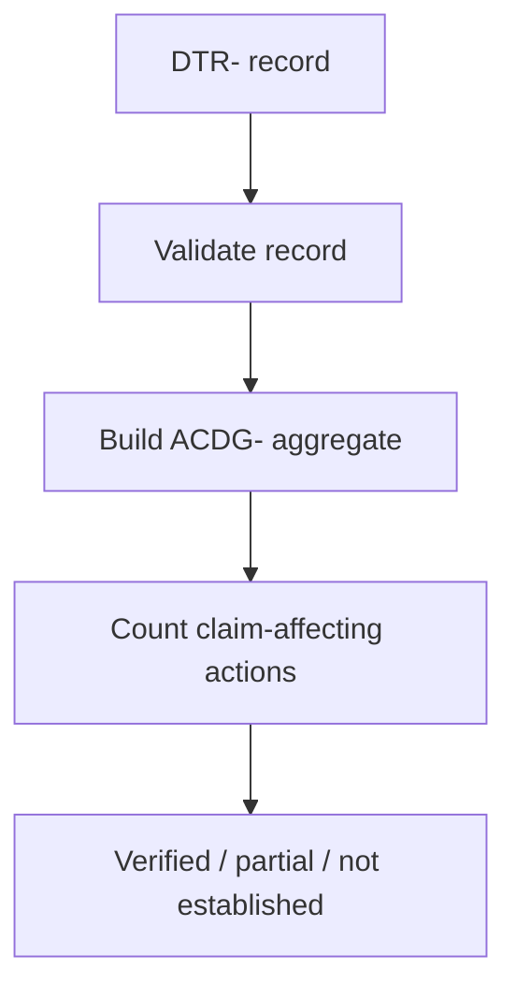
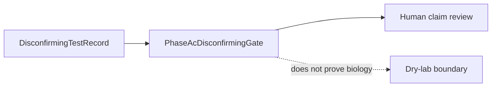
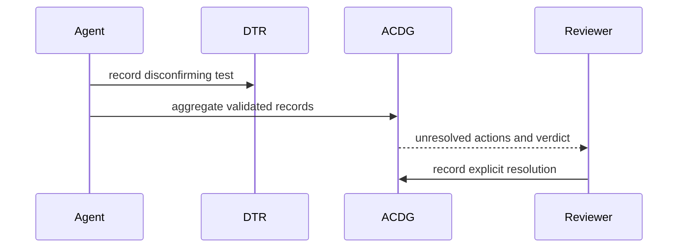
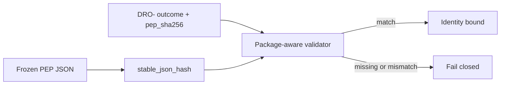

# Evidence Module

## Overview

Evidence records are dry-lab review artifacts. They must preserve limitations,
claim boundaries, reproducibility metadata, and explicit negative findings.

## Key Components

- `disconfirming_test_record.py`: one auditable attempt to disprove a claim.
- `phase_ac_disconfirming_gate.py`: aggregate gate for unresolved follow-up.
- `phase_z_accountability_gate.py`: aggregate gate for per-family benchmark
  and adapter accountability artifacts.
- `external_review_packet.py`: current V4 component-based review packet; its
  legacy Phase E bridge is migration-only.
- `domain_review_outcome.py`: records reviewer outcomes. Use its package-aware
  validator when the frozen PEP JSON is available; `pep_sha256` binds the
  outcome to that exact JSON but does not authenticate the reviewer or prove
  biology.

## Diagrams (Mermaid)

### Flowchart

### Component Diagram

### Sequence Diagram

### Frozen review-package identity

