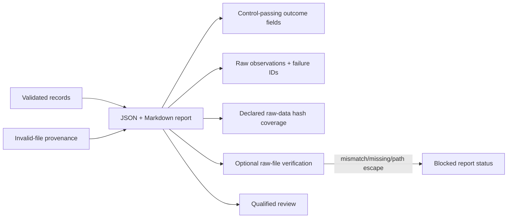
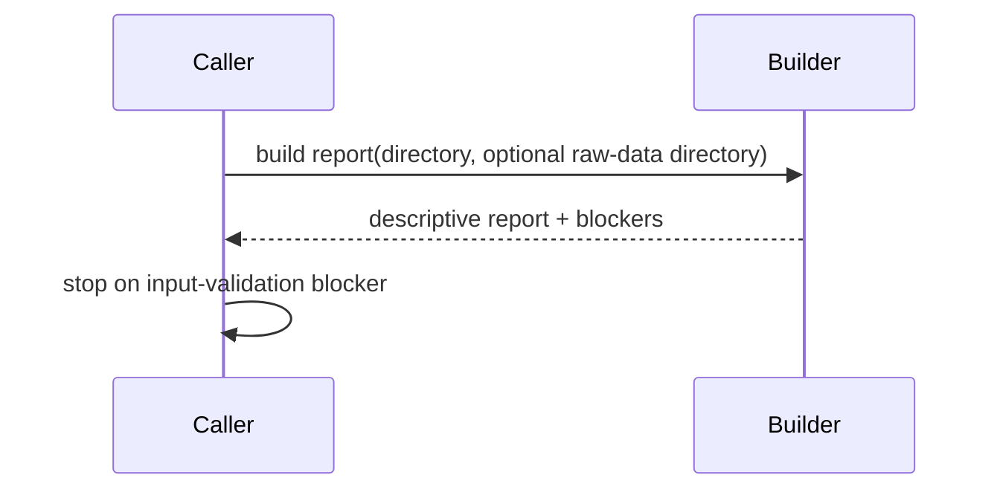

# Reports

## Overview

Report builders turn validated computational or experimental records into
review artifacts without strengthening scientific claims.

## Key Components

- `lab_result_report.py`: result counts, candidate rollups, controls, and input
  validation blockers. Markdown and JSON distinguish control-passing outcome
  counts from raw audit observations, including failed-control qualitative
  results. They also show declared raw-data hash coverage without calling it
  independently verified.
- `recalibration_report.py`: proposal/gate summaries; proposals are not applied.

## Diagrams (Mermaid)

