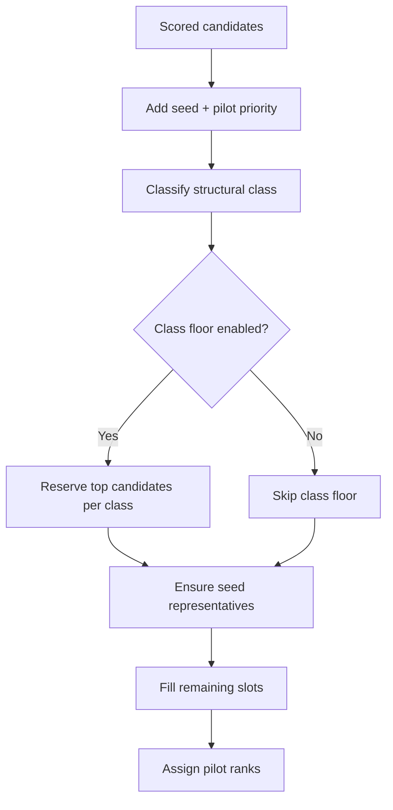
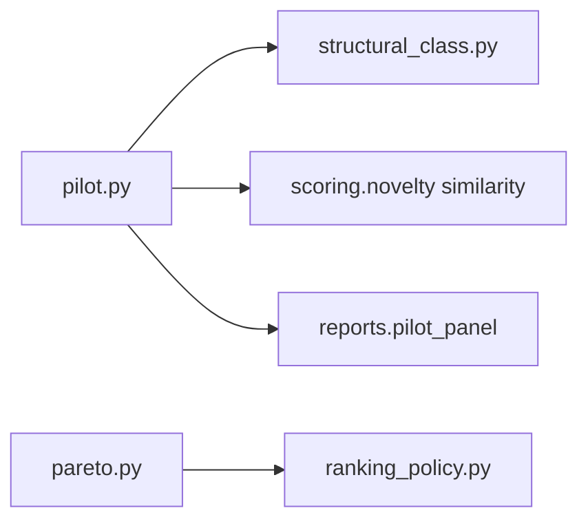
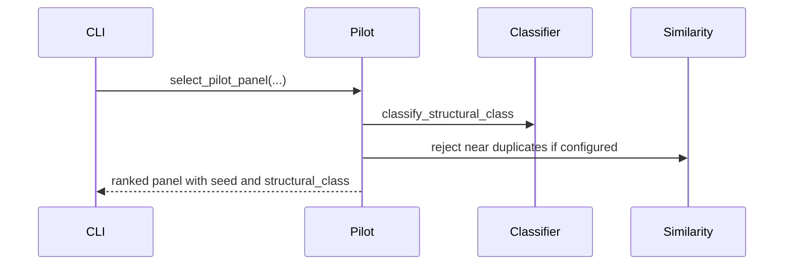

# Selection Module

## Overview

Selection turns scored candidates into reviewable panels. It must preserve
scientific honesty: diversity or structural-class floors are panel-construction
guards, not biological proof and not scoring improvements.

## Key Components

- `pilot.py`: pilot-panel selection by priority, seed coverage, optional
  similarity filter, optional structural-class floor.
- `structural_class.py`: shared six-class heuristic used by both per-family
  benchmarking and pilot-panel floor logic.
- `diversity.py`: sequence diversity and family warnings.
- `pareto.py`: ranking helpers for ensemble/expert modes.
- `ranking_policy.py`: records why a ranking mode was used.

## Diagrams

### Flowchart

### Component Diagram

### Sequence Diagram

