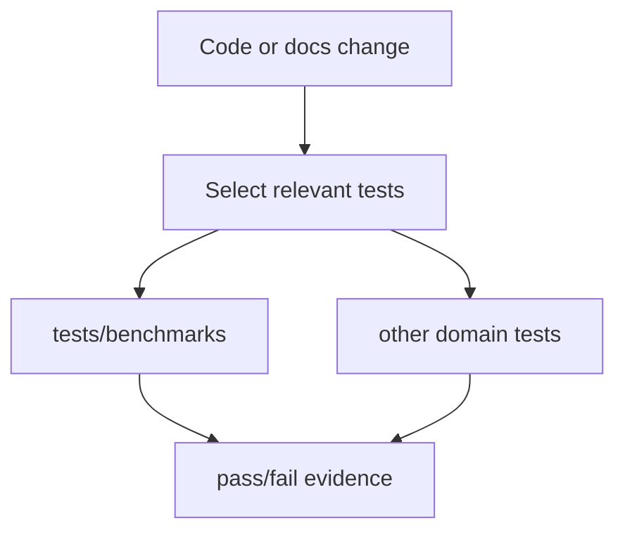
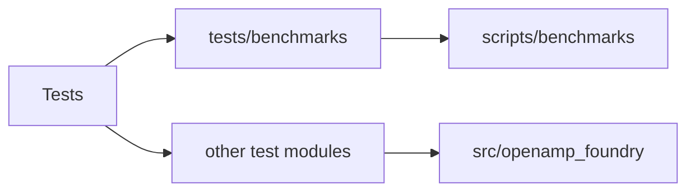
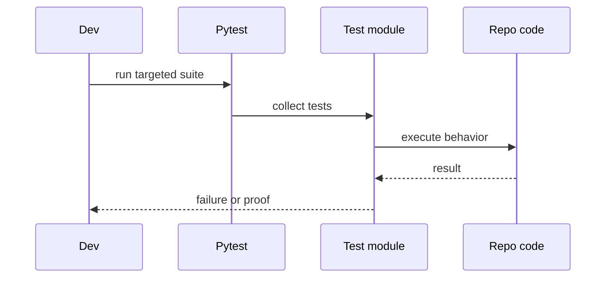

# Tests

## Overview

`tests/` mirrors behavior, not marketing. Subfolders should reveal the domain
under test. Benchmark-specific checks live in `tests/benchmarks/`.

## Key Components

- `benchmarks/`: regression-gate and benchmark-runner tests.
- `calibration/`: calibration workflow, gate, intake, and policy-version tests.
- `external/`: external prediction workflow tests.
- `lab/`: lab handoff, data-return validation, and pass/fail tests.
- `novelty/`: novelty scoring and novelty-pressure tests.
- `release/`: release artifact and reproducibility tests.
- `waves/`: wave-program gate and panel-contract tests.
- remaining top-level tests: package, CLI, scoring, selection, calibration, and
  evidence coverage awaiting further taxonomy work.
- CLI gate tests must assert both the successful verdict and the fail-closed
  result for an incomplete or unsafe record.
- Per-family ZAG- CLI tests must keep the complete-versus-incomplete artifact
  distinction explicit.

## Diagrams (Mermaid)

- Flowchart

- Component Diagram

- Sequence Diagram

