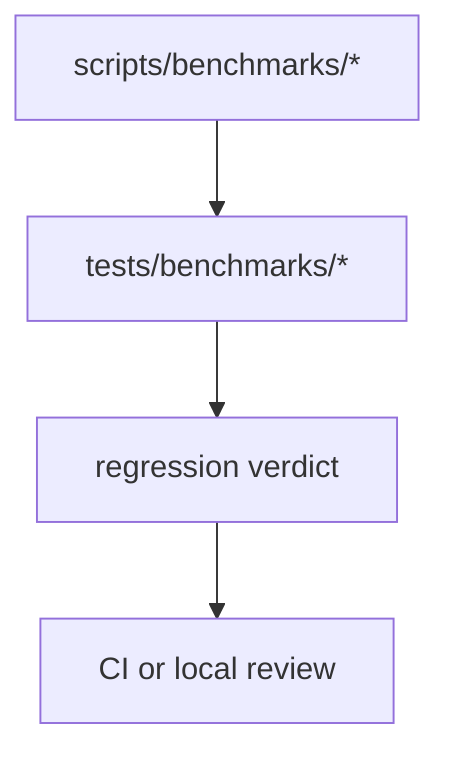
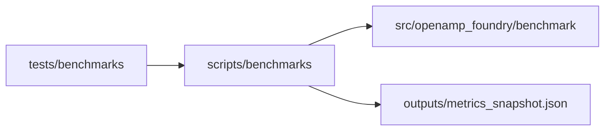
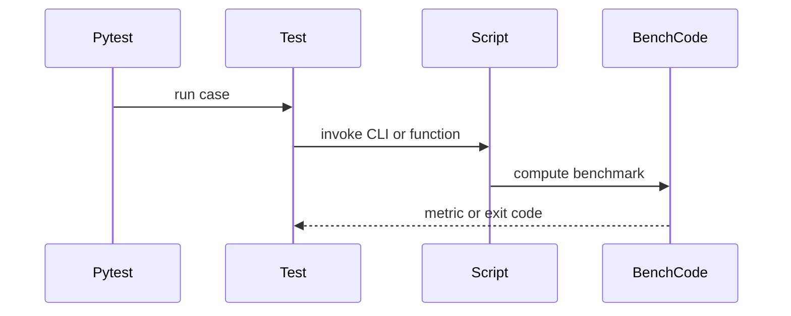

# Benchmark Tests

## Overview

This folder verifies benchmark scripts, benchmark invariants, and benchmark
reporting. Use it when a change could alter benchmark truth, baseline gates, or
benchmark CLI behavior.

## Key Components

- `test_benchmark_*.py`: benchmark-runner and gate coverage.
- `test_charge_matched_benchmark.py`: charge-matched honesty checks.
- `test_cluster_split_benchmark.py`: leakage-resistant cluster benchmark checks.
- `test_selectivity_benchmark.py`: within-AMP benchmark checks.
- `test_triage_benchmark.py`: triage benchmark checks.

## Diagrams (Mermaid)

- Flowchart

- Component Diagram

- Sequence Diagram

