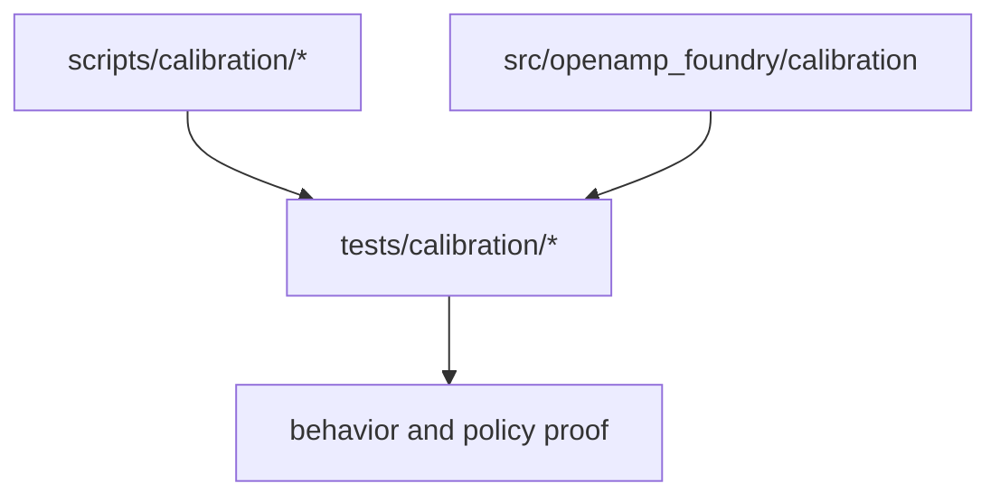
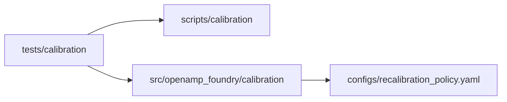
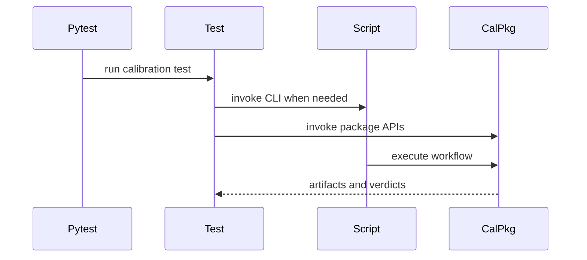
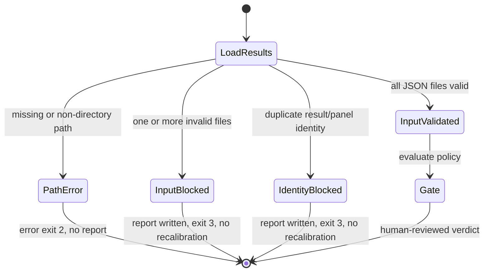

# Calibration Tests

## Overview

This folder verifies the calibration subsystem: intake, policy versioning,
gate behavior, and the synthetic end-to-end calibration loop.

## Key Components

- `test_bump_recalibration_policy.py`
- `test_calibration_e2e.py`
- `test_calibration_intake.py`
- `test_policy_version.py`
- `test_recalibration_gate.py`
- Invalid result files are retained as intake provenance and must block both
  the intake CLI and recalibration gate.
- Missing or non-directory result paths must return an input error before a
  report is written; an existing empty directory remains valid.
- Control-failed assay observations remain visible but cannot contribute to
  per-assay cohort metrics; tests must preserve this fail-closed boundary.

## Diagrams (Mermaid)

- Flowchart

- Component Diagram

- Sequence Diagram

- Input-validation state machine

