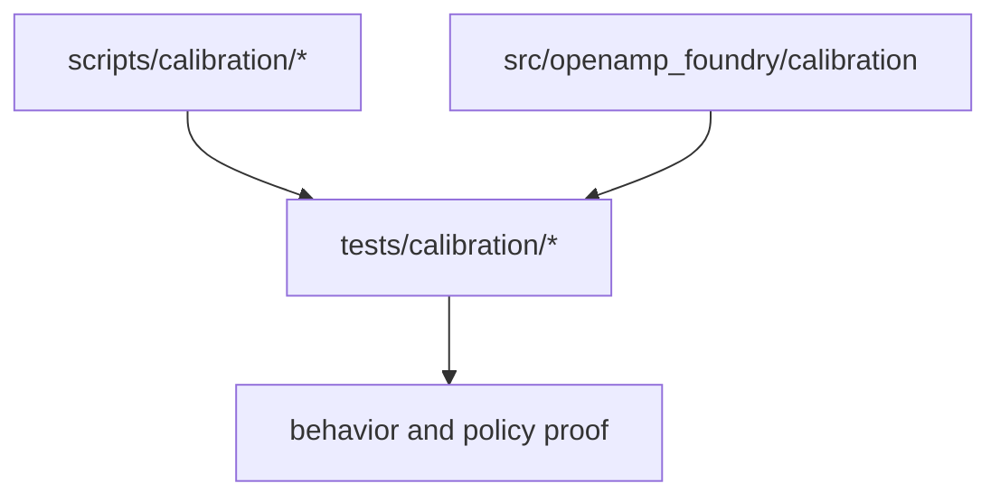
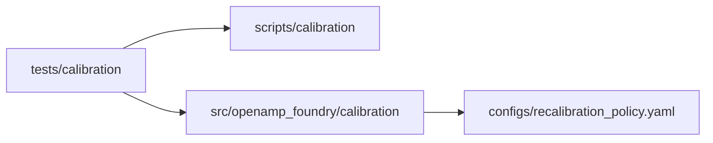
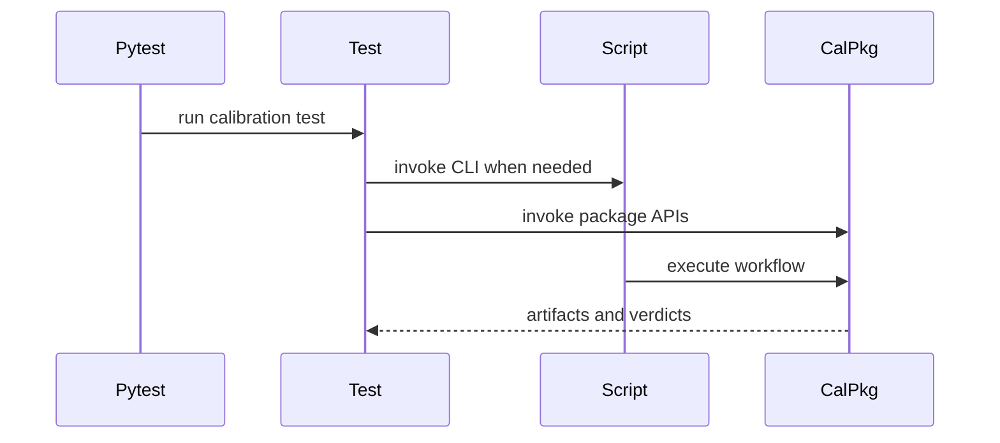

# Calibration Tests

## Overview

This folder verifies the calibration subsystem: intake, policy versioning,
gate behavior, and the synthetic end-to-end calibration loop.

## Key Components

- `test_bump_recalibration_policy.py`
- `test_calibration_e2e.py`
- `test_calibration_intake.py`
- `test_policy_version.py`
- `test_recalibration_gate.py`

## Diagrams (Mermaid)

- Flowchart

- Component Diagram

- Sequence Diagram

