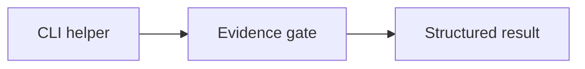

# CLI Unit Tests

## Overview

This folder contains focused tests for command helpers and parser-adjacent
behavior. Public gate behavior belongs in `tests/integration/test_cli.py`.

## Diagrams (Mermaid)

