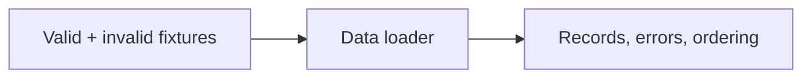
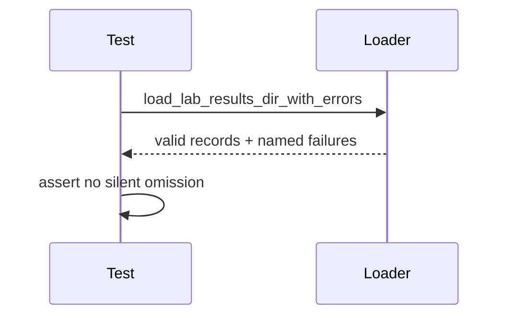

# Data Tests

## Overview

Tests protect schema validation, ordering, summaries, and retained invalid-file
provenance for result ingestion.

## Key Components

- `test_lab_results.py`: loader and summary behavior.

## Diagrams (Mermaid)

