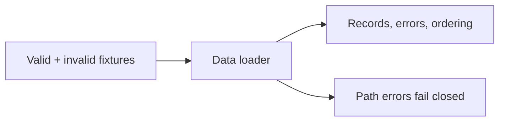
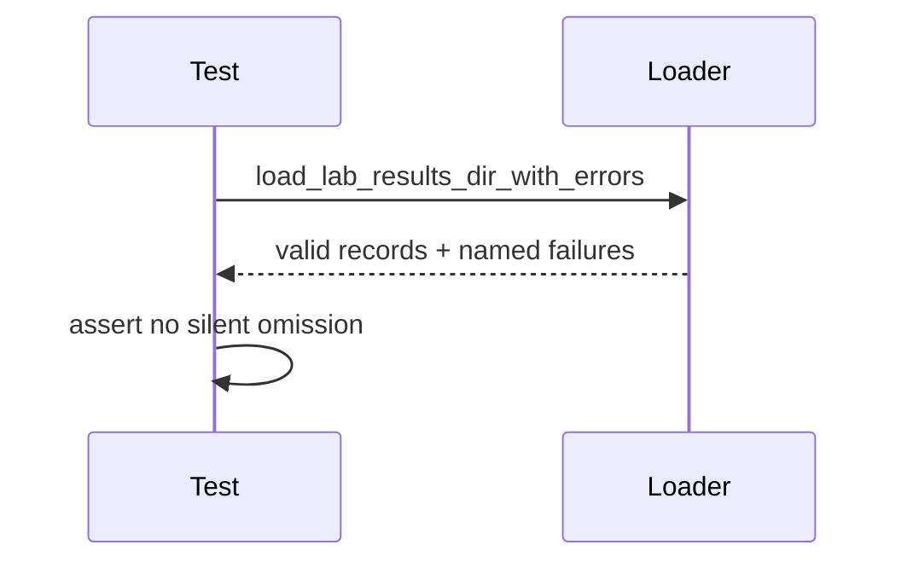

# Data Tests

## Overview

Tests protect schema validation, ordering, summaries, and retained invalid-file
provenance for result ingestion.

## Key Components

- `test_lab_results.py`: loader, summary, and missing/non-directory path
  behavior, including the boundary between raw and control-passing outcomes.

## Diagrams (Mermaid)

