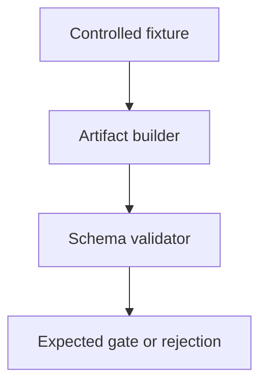
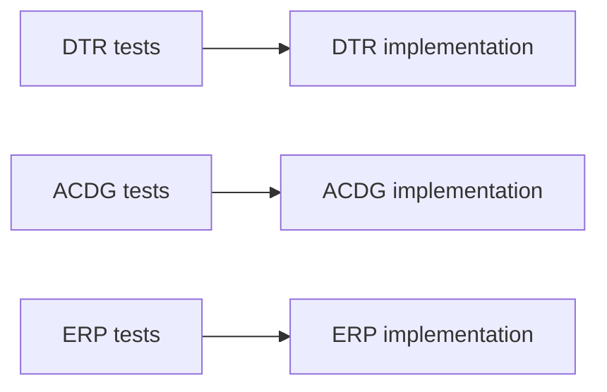
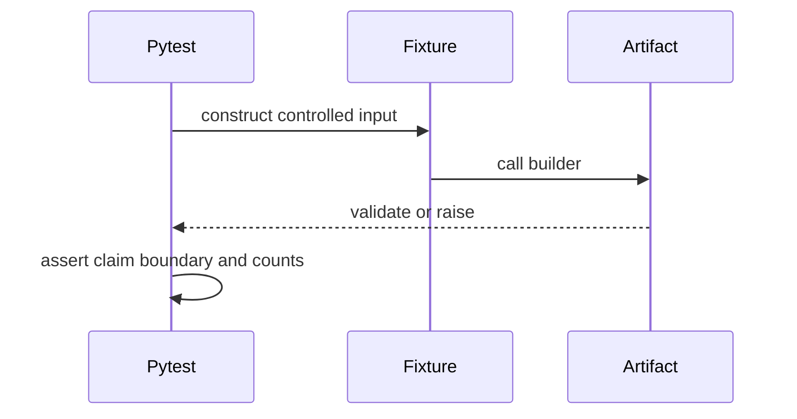

# Evidence Tests

## Overview

Evidence tests protect schema invariants, negative findings, and claim
boundaries. Focused gate tests must cover empty, partial, resolved, and
malformed records.

## Key Components

- `test_phase_ac_disconfirming_gate.py`: ACDG- aggregate behavior.
- `test_disconfirming_test_record.py`: DTR- record invariants.
- `test_external_review_packet.py`: current V4 ERP contract.
- `test_domain_review_outcome.py`: legacy DRO validation plus fail-closed
  frozen-package hash binding when a PEP JSON is supplied.

## Diagrams (Mermaid)

### Flowchart

### Component Diagram

### Sequence Diagram

