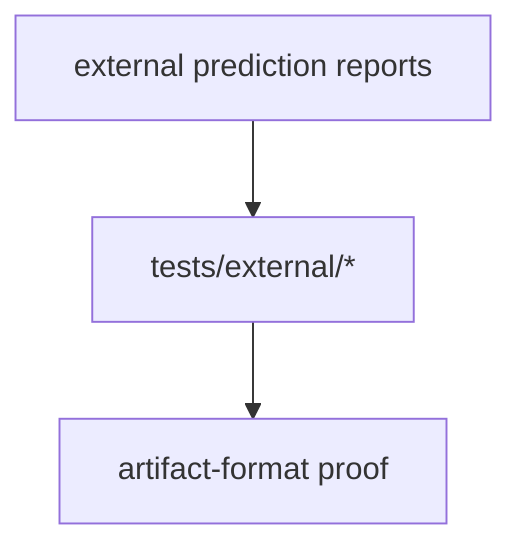
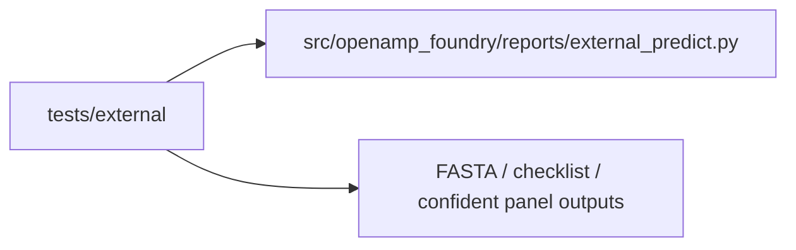
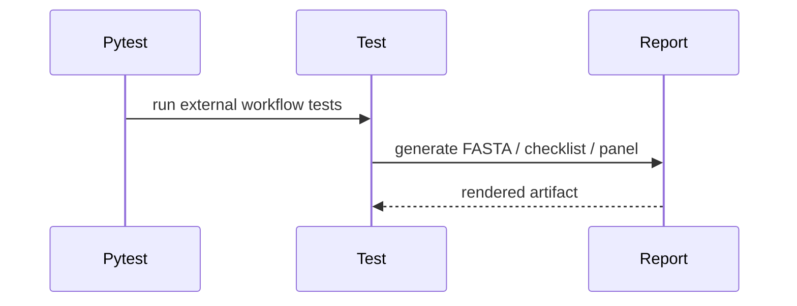

# External Tests

## Overview

This folder verifies the external prediction workflow surfaces that generate
submission artifacts and reviewer-facing checklists.

## Key Components

- `test_external_predict.py`

## Diagrams (Mermaid)

- Flowchart

- Component Diagram

- Sequence Diagram

