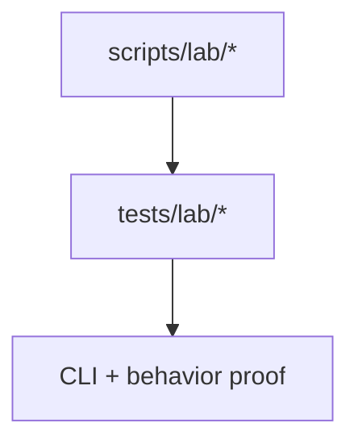
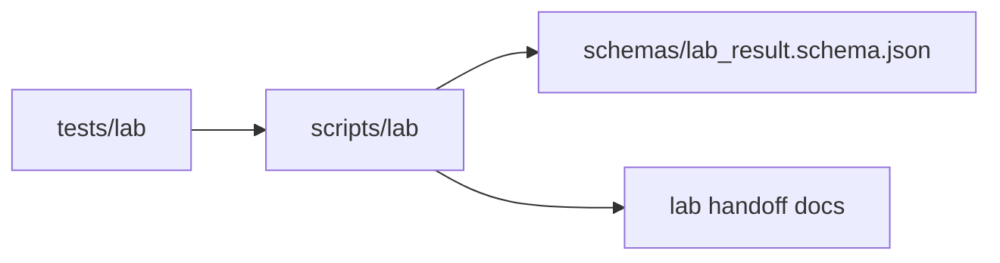
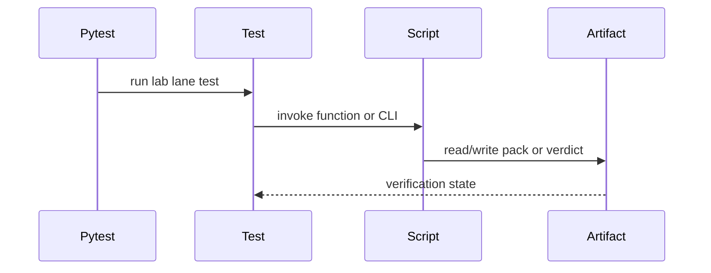

# Lab Tests

## Overview

This folder verifies the lab handoff lane: pack creation, returned-result
validation, and batch pass/fail evaluation.

## Key Components

- `test_lab_batch_pack.py`
- `test_validate_lab_data_return.py`
- `test_wave1_pass_fail.py`

## Diagrams (Mermaid)

- Flowchart

- Component Diagram

- Sequence Diagram

