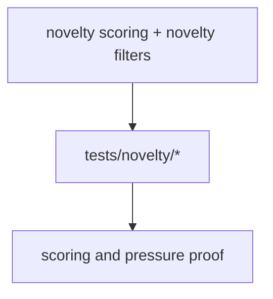
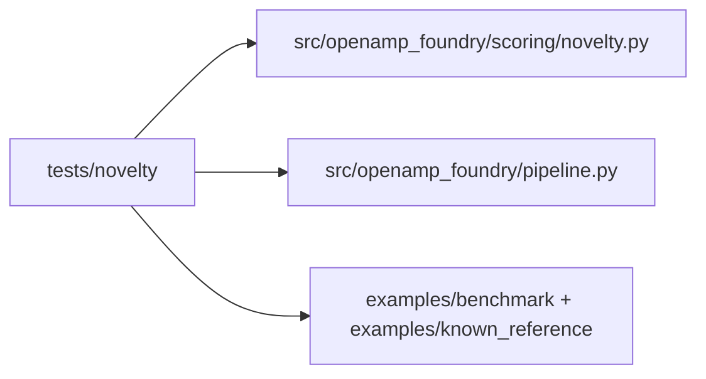
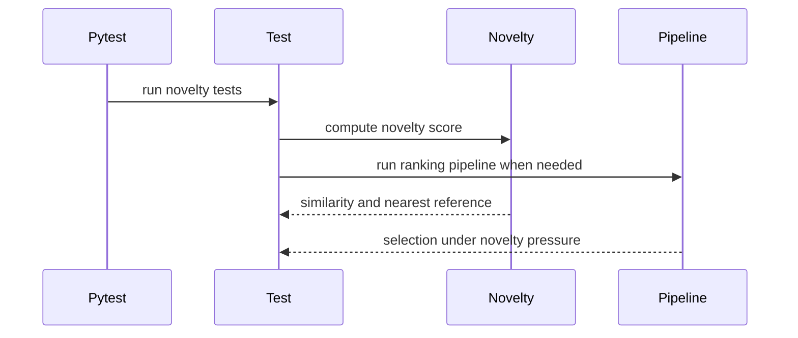

# Novelty Tests

## Overview

This folder verifies novelty scoring behavior and novelty-pressure effects in
selection.

## Key Components

- `test_novelty.py`
- `test_novelty_pressure.py`

## Diagrams (Mermaid)

- Flowchart

- Component Diagram

- Sequence Diagram

