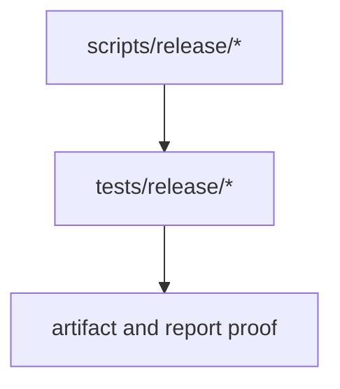
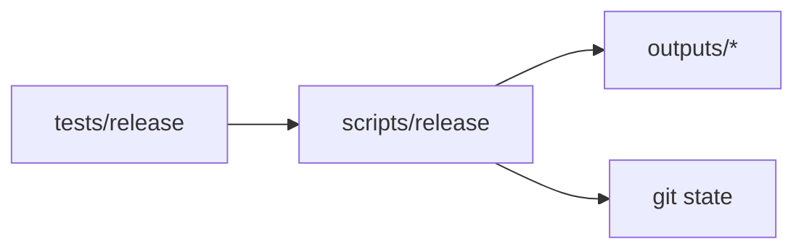
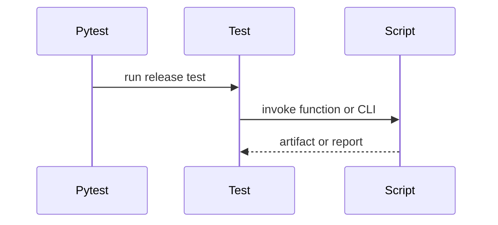

# Release Tests

## Overview

This folder verifies release-facing artifact operations and reproducibility
reporting.

## Key Components

- `test_regenerate_all.py`
- `test_full_reproducibility_report.py`

## Diagrams (Mermaid)

- Flowchart

- Component Diagram

- Sequence Diagram

