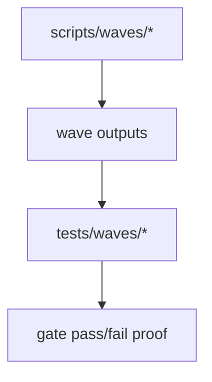
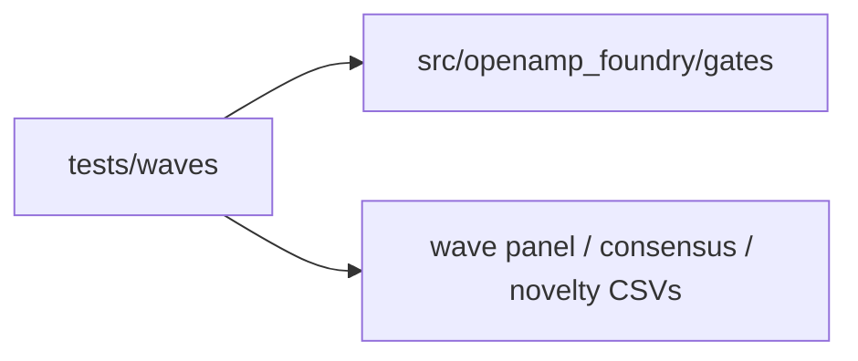
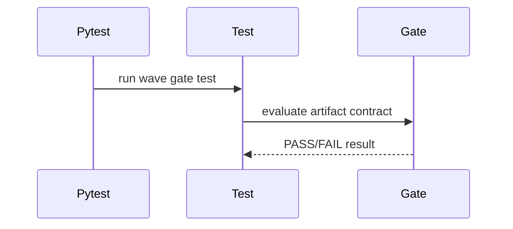

# Wave Tests

## Overview

This folder verifies wave-program specific rules and contracts, especially
gates that decide whether a wave panel is structurally safe to interpret.

## Key Components

- `test_wave0_5_gates.py`

## Diagrams (Mermaid)

- Flowchart

- Component Diagram

- Sequence Diagram

